+++
tags = ["mathematics", "prealgebra", "whole_numbers"]

[generation]
source = "sources/1_whole_numbers/content.json"
figures_dir = "sources/1_whole_numbers/figures"
generated_at = "2025-12-15T23:46:00.776Z"
flashcards_commit = "1b82fc0"
model = "claude-code-cli"
guides = ["general.md", "mathematics.md"]
+++

# Chapter 1: Whole Numbers

## 1.1 Introduction to Whole Numbers

### Counting Numbers and Whole Numbers

C: The counting numbers (also called [natural numbers]) are: 1, 2, 3, 4, 5, ...

C: The whole numbers are the counting numbers and [zero]: 0, 1, 2, 3, 4, 5, ...

Q: What is the difference between counting numbers and whole numbers?
A: Whole numbers include zero, while counting numbers start at 1. Counting numbers = {1, 2, 3, ...}; Whole numbers = {0, 1, 2, 3, ...}

### Place Value

C: Our number system is a [place value system] because the value of a digit depends on its position in a number.

Q: In the number 537, why does the 7 have a different value than in 735?
A: Because of place value - the position of a digit determines its value. In 537, the 7 is in the ones place (value 7). In 735, the 7 is in the hundreds place (value 700).

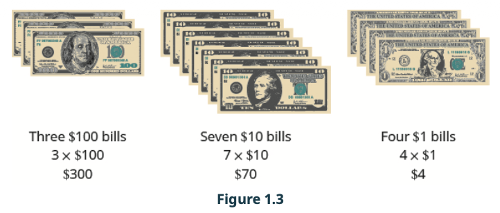

Q: Looking at Figure 1.3, how does money model place value?
A: $100 bills represent hundreds place, $10 bills represent tens place, $1 bills represent ones place. Three $100 bills + seven $10 bills + four $1 bills = $374.

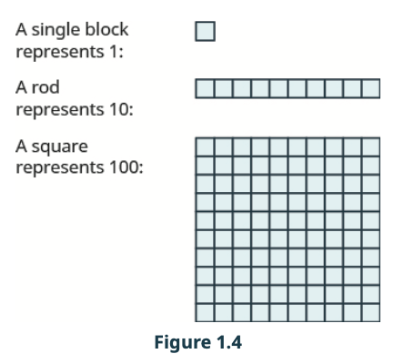

Q: In base-10 blocks, what do the three block types represent?
A: A single block = 1 (ones), a rod (10 blocks in a row) = 10 (tens), a square (10×10 grid) = 100 (hundreds).

P: Use base-10 blocks to find the value of the number: 1 hundred-square, 3 ten-rods, 8 one-blocks.

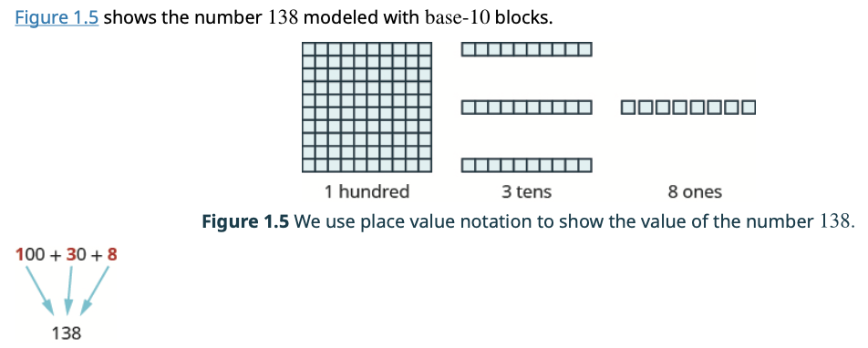

S:
**IDENTIFY**: Base-10 blocks modeling place value

**EXECUTE**:
- 1 hundred-square = 100
- 3 ten-rods = 30
- 8 one-blocks = 8

**EVALUATE**: 100 + 30 + 8 = 138

P: Determine the number modeled by base-10 blocks: 2 hundred-squares, 1 ten-rod, 5 one-blocks.

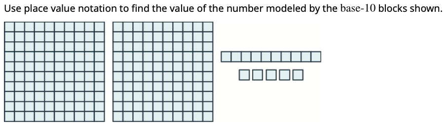

S:
**IDENTIFY**: Count each type of block

**EXECUTE**:
- 2 hundred-squares = 200
- 1 ten-rod = 10
- 5 one-blocks = 5
- Total: 200 + 10 + 5 = 215

**EVALUATE**: The blocks model 215 ✓

C: In a place value chart, each place value is [ten times] the value of the place to its right.

Q: In the number 5,278,194, what is the value of the digit 5?
A: 5,000,000 (five million) - the 5 is in the millions place.

Q: In the number 63,407,218, what place is the digit 7 in?
A: The thousands place (its value is 7,000).

### Naming Whole Numbers

C: When writing a number in words, the word ["and"] is [not] used when naming a whole number.

P: Name the number 37,519,248 in words.

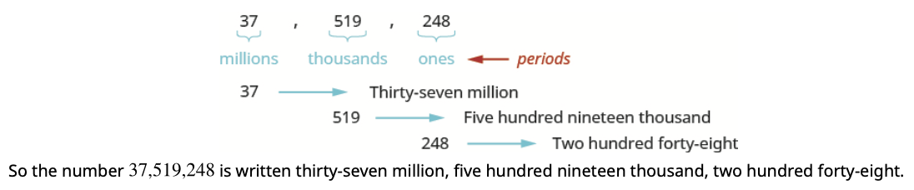

S:
**IDENTIFY**: Separate into periods (millions, thousands, ones)

**EXECUTE**:
- 37 millions = "thirty-seven million"
- 519 thousands = "five hundred nineteen thousand"  
- 248 ones = "two hundred forty-eight"

**EVALUATE**: Thirty-seven million, five hundred nineteen thousand, two hundred forty-eight

P: Name the number 8,165,432,098,710 in words.

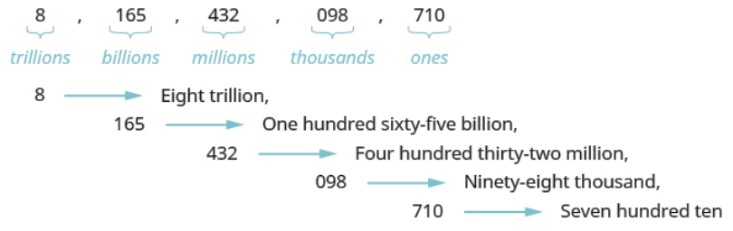

S:
**IDENTIFY**: Separate into periods from left to right

**EXECUTE**:
- 8 trillions = "eight trillion"
- 165 billions = "one hundred sixty-five billion"
- 432 millions = "four hundred thirty-two million"
- 098 thousands = "ninety-eight thousand"
- 710 ones = "seven hundred ten"

**EVALUATE**: Eight trillion, one hundred sixty-five billion, four hundred thirty-two million, ninety-eight thousand, seven hundred ten

P: Write "fifty-three million, four hundred one thousand, seven hundred forty-two" in digits.

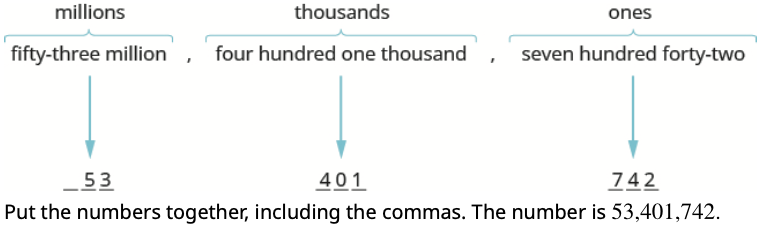

S:
**IDENTIFY**: Identify periods: millions, thousands, ones

**PLAN**: Draw blanks for each period, three places each

**EXECUTE**:
- Millions: 53
- Thousands: 401 (need placeholder zero)
- Ones: 742
- Result: 53,401,742

**EVALUATE**: Check that each period has correct digits ✓

P: Write "nine billion, two hundred forty-six million, seventy-three thousand, one hundred eighty-nine" in digits.

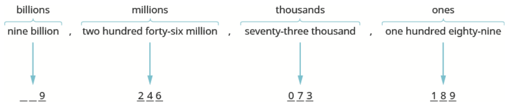

S:
**IDENTIFY**: Periods: billions, millions, thousands, ones

**EXECUTE**:
- Billions: 9
- Millions: 246
- Thousands: 073 (need placeholder zero in hundreds)
- Ones: 189
- Result: 9,246,073,189

**EVALUATE**: Note the zero placeholder in thousands period ✓

### Rounding Whole Numbers

C: The process of approximating a number is called [rounding].

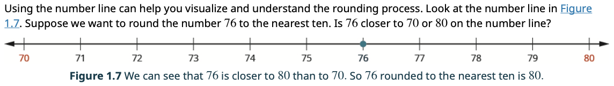

Q: Looking at the number line, why does 76 round to 80 instead of 70?
A: On the number line, 76 is closer to 80 than to 70, so it rounds to the nearest ten as 80.

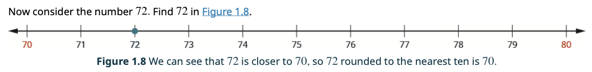

Q: Why does 72 round to 70?
A: 72 is closer to 70 than to 80 on the number line, so it rounds down to 70.

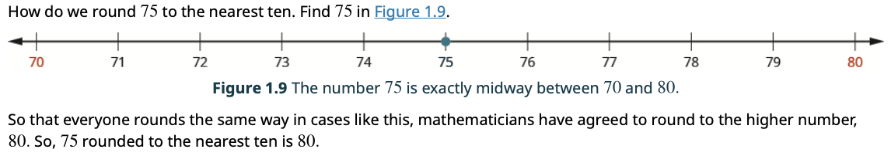

Q: What is the rule when a number is exactly halfway between two rounding values?
A: Round to the higher number. For example, 75 is exactly halfway between 70 and 80, so it rounds to 80.

P: Round 843 to the nearest ten.

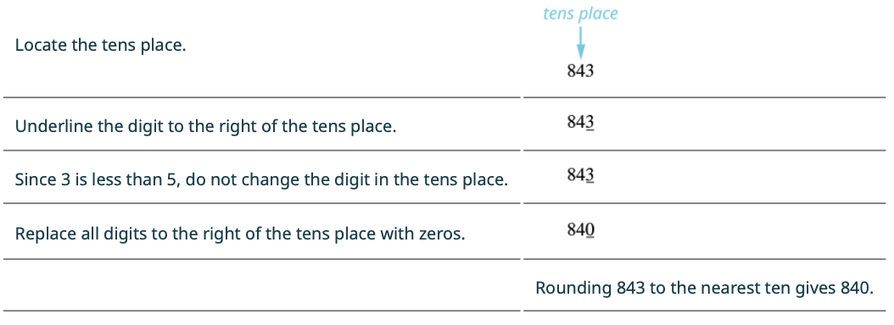

S:
**IDENTIFY**: Locate tens place (4)

**PLAN**: Look at digit to right (3), determine if ≥ 5

**EXECUTE**:
- Ones digit: 3
- Since 3 < 5, keep tens digit same
- Replace ones with 0
- Result: 840

**EVALUATE**: 843 rounds to 840 ✓

P: Round 76 to the nearest ten.

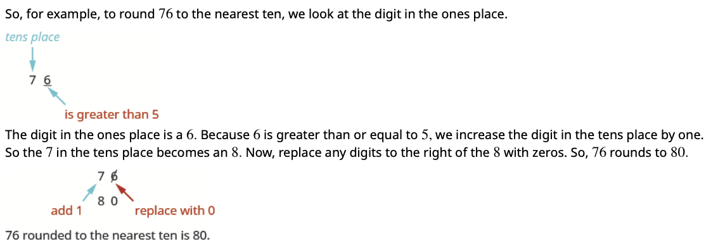

S:
**IDENTIFY**: Tens place is 7

**EXECUTE**:
- Ones digit: 6
- Since 6 ≥ 5, add 1 to tens place: 7 → 8
- Replace ones with 0
- Result: 80

**EVALUATE**: 76 rounds to 80 ✓

P: Round 3,978 to the nearest hundred.

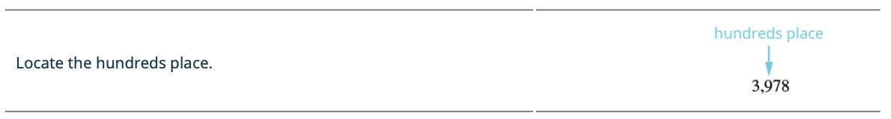
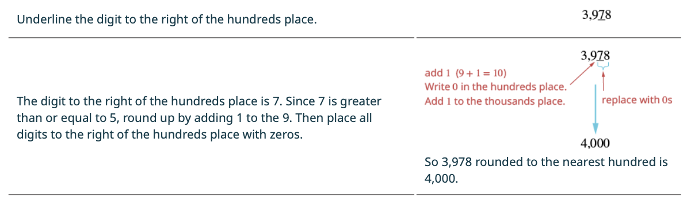

S:
**IDENTIFY**: Hundreds place is 9

**EXECUTE**:
- Tens digit: 7
- Since 7 ≥ 5, add 1 to hundreds place
- 9 + 1 = 10, write 0 in hundreds, carry 1 to thousands
- Replace digits to right with zeros
- Result: 4,000

**EVALUATE**: When rounding up causes 10, regroup to next place ✓

P: Round 147,032 to the nearest thousand.

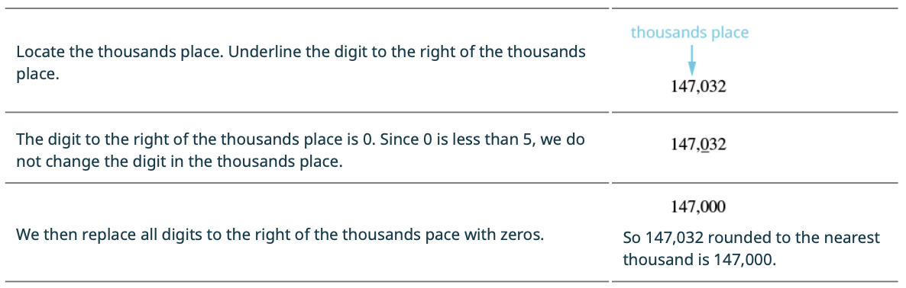

S:
**IDENTIFY**: Thousands place is 7

**EXECUTE**:
- Hundreds digit: 0
- Since 0 < 5, keep thousands digit same
- Replace all digits to right with zeros
- Result: 147,000

**EVALUATE**: 147,032 rounds to 147,000 ✓

P: Round 29,504 to the nearest thousand.

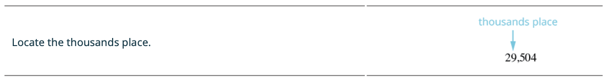
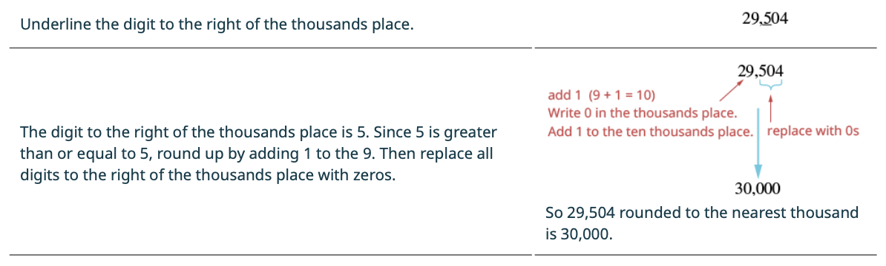

S:
**IDENTIFY**: Thousands place is 9

**EXECUTE**:
- Hundreds digit: 5
- Since 5 ≥ 5, add 1 to thousands
- 9 + 1 = 10, write 0 in thousands, add 1 to ten-thousands
- 2 + 1 = 3
- Replace digits to right with zeros
- Result: 30,000

**EVALUATE**: Regrouping when adding to 9 gives 30,000 ✓

## 1.2 Add Whole Numbers

### Addition Notation

C: In the expression $3 + 4$, the numbers 3 and 4 are called [addends], and the result is called the [sum].

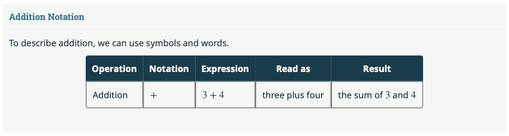

Q: How do you write "three plus four" in mathematical notation?
A: 3 + 4. This reads as "three plus four" and the result is "the sum of three and four."

Q: What are five word phrases that indicate addition?
A: Plus, sum, increased by, more than, total of, added to. For example: "the sum of 3 and 4" = 3 + 4.

### Modeling Addition

P: Model the addition 2 + 6 using blocks.

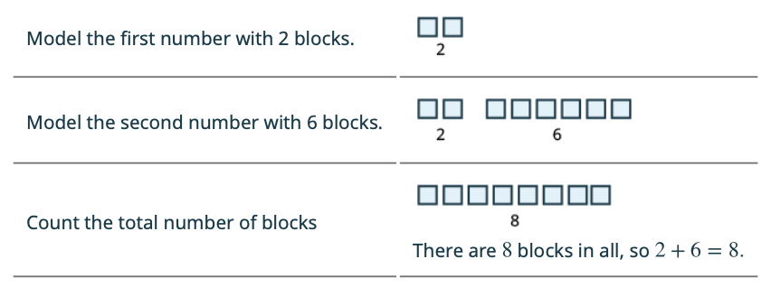

S:
**IDENTIFY**: Adding 2 and 6

**EXECUTE**:
- Model 2 with 2 ones blocks
- Model 6 with 6 ones blocks
- Combine and count total

**EVALUATE**: 2 + 6 = 8 blocks ✓

P: Model the addition 5 + 8 using base-10 blocks.

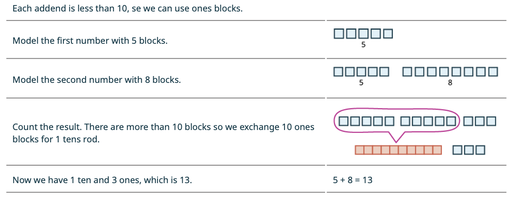

S:
**IDENTIFY**: Adding 5 and 8 (more than 10)

**EXECUTE**:
- Start with 5 ones + 8 ones = 13 ones
- Exchange 10 ones blocks for 1 tens rod
- Result: 1 ten and 3 ones

**EVALUATE**: 5 + 8 = 13 (regrouping required) ✓

P: Model 17 + 26 using base-10 blocks.

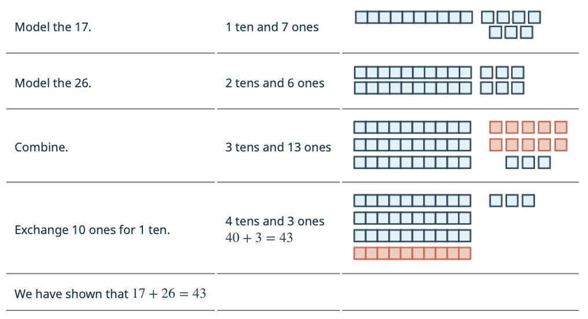

S:
**IDENTIFY**: Two-digit addition with regrouping

**EXECUTE**:
- Model 17: 1 ten, 7 ones
- Model 26: 2 tens, 6 ones
- Combine: 3 tens, 13 ones
- Exchange 10 ones for 1 ten: 4 tens, 3 ones

**EVALUATE**: 17 + 26 = 43 ✓

### Addition Properties

C: The [Identity Property of Addition] states that the sum of any number and 0 is the number: $a + 0 = 0 + a = a$

Q: What is 42 + 0?
A: 42. The Identity Property of Addition states that adding zero to any number gives that number.

C: The [Commutative Property of Addition] states that changing the order of addends does not change the sum: $a + b = b + a$

Q: Why is 8 + 7 equal to 7 + 8?
A: The Commutative Property of Addition - changing the order of addends doesn't change the sum. Both equal 15.

### Addition with Carrying

P: Add 43 + 69.

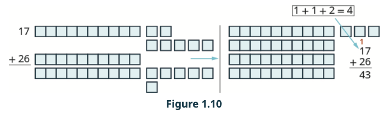

S:
**IDENTIFY**: Two-digit addition with carrying

**EXECUTE**:
1. Write vertically, align place values
2. Ones: 3 + 9 = 12, write 2, carry 1
3. Tens: 1 + 4 + 6 = 11, write 11

**EVALUATE**: 43 + 69 = 112 ✓

P: Add 324 + 586.

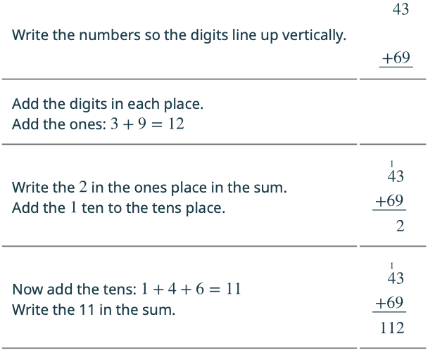
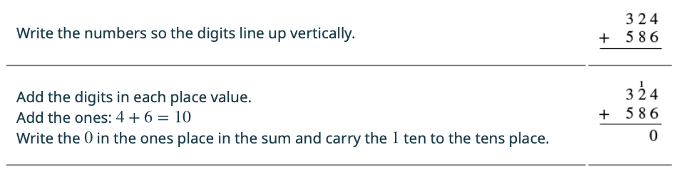
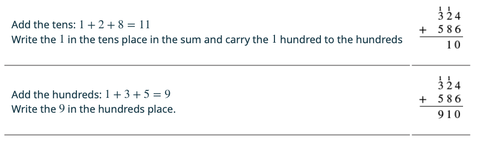

S:
**IDENTIFY**: Three-digit addition with multiple carries

**EXECUTE**:
1. Ones: 4 + 6 = 10, write 0, carry 1
2. Tens: 1 + 2 + 8 = 11, write 1, carry 1
3. Hundreds: 1 + 3 + 5 = 9, write 9

**EVALUATE**: 324 + 586 = 910 ✓

P: Add 1,683 + 479.

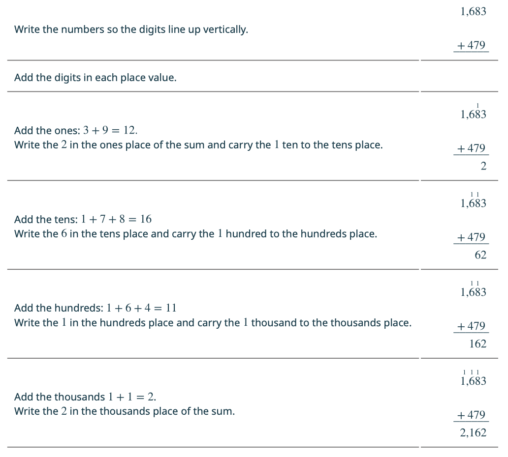

S:
**IDENTIFY**: Four-digit plus three-digit with carrying

**EXECUTE**:
1. Ones: 3 + 9 = 12, write 2, carry 1
2. Tens: 1 + 8 + 7 = 16, write 6, carry 1
3. Hundreds: 1 + 6 + 4 = 11, write 1, carry 1
4. Thousands: 1 + 1 = 2

**EVALUATE**: 1,683 + 479 = 2,162 ✓

P: Add 21,357 + 861 + 8,596.

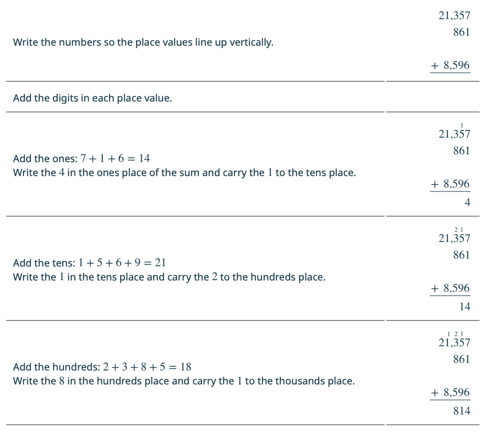
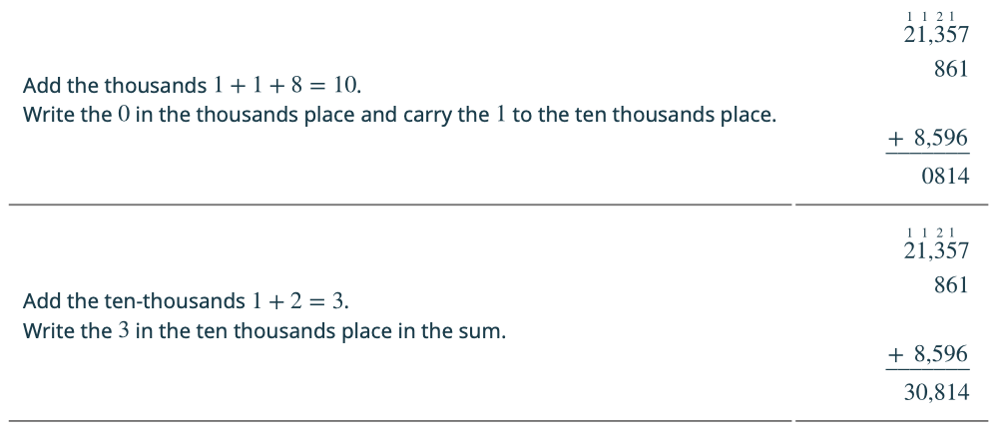

S:
**IDENTIFY**: Adding three numbers with different digit counts

**EXECUTE**:
1. Align by place value
2. Ones: 7 + 1 + 6 = 14, write 4, carry 1
3. Tens: 1 + 5 + 6 + 9 = 21, write 1, carry 2
4. Hundreds: 2 + 3 + 8 + 5 = 18, write 8, carry 1
5. Thousands: 1 + 1 + 8 = 10, write 0, carry 1
6. Ten-thousands: 1 + 2 = 3

**EVALUATE**: 21,357 + 861 + 8,596 = 30,814 ✓

### Word Phrases for Addition

Q: How do you translate "the sum of 19 and 23" to math notation?
A: 19 + 23. The word "sum" indicates addition, and "of 19 and 23" tells us the addends.

Q: What does "28 increased by 31" mean?
A: 28 + 31. "Increased by" indicates addition, so add 31 to 28.

### Perimeter Applications

C: The [perimeter] of a figure is the sum of the lengths of its sides.

P: Find the perimeter of a patio with sides 9 ft, 4 ft, 2 ft, 3 ft, 6 ft, and 2 ft.

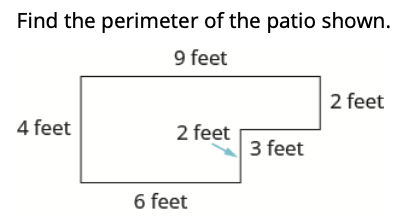

S:
**IDENTIFY**: Perimeter = sum of all side lengths

**EXECUTE**: 9 + 4 + 2 + 3 + 6 + 2 = 26 feet

**EVALUATE**: All six sides added correctly ✓

P: Find the perimeter of a triangle with sides 14 in, 12 in, and 18 in.

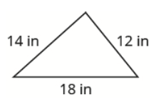

S:
**IDENTIFY**: Triangle perimeter

**EXECUTE**: 14 + 12 + 18 = 44 inches

**EVALUATE**: Sum of three sides ✓

P: Find the perimeter of a rectangle 19 ft by 14 ft.

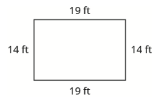

S:
**IDENTIFY**: Rectangle has 4 sides (opposite sides equal)

**EXECUTE**: 19 + 14 + 19 + 14 = 66 feet

**EVALUATE**: Could also use 2(19 + 14) = 66 ✓

## 1.3 Subtract Whole Numbers

### Subtraction Notation

C: When we subtract, we take one number away from another to find the [difference].

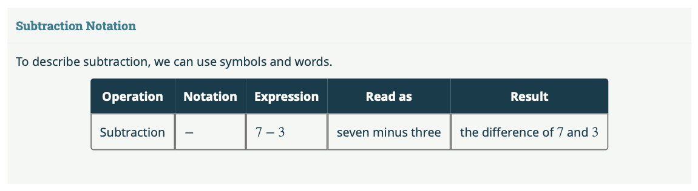

Q: How do you read 7 - 3 in words?
A: "Seven minus three." The result is called "the difference of seven and three."

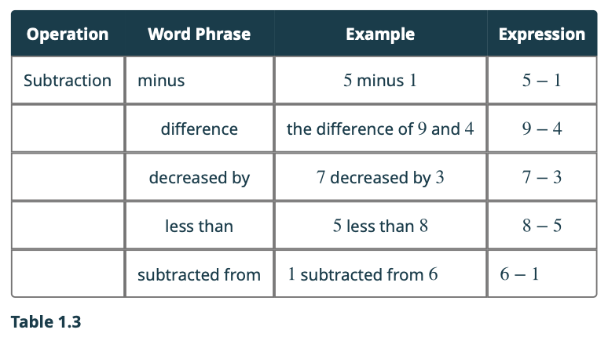

Q: What are five word phrases that indicate subtraction?
A: Minus, difference, decreased by, less than, subtracted from. Note: "5 less than 8" = 8 - 5 (order matters!).

### Modeling Subtraction

P: Model 8 - 2 using blocks.

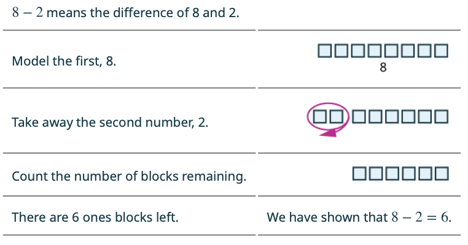

S:
**IDENTIFY**: Take away subtraction

**EXECUTE**:
- Model 8 with 8 ones blocks
- Circle 2 blocks to take away
- Count remaining: 6 blocks

**EVALUATE**: 8 - 2 = 6 ✓

P: Model 13 - 8 using base-10 blocks.

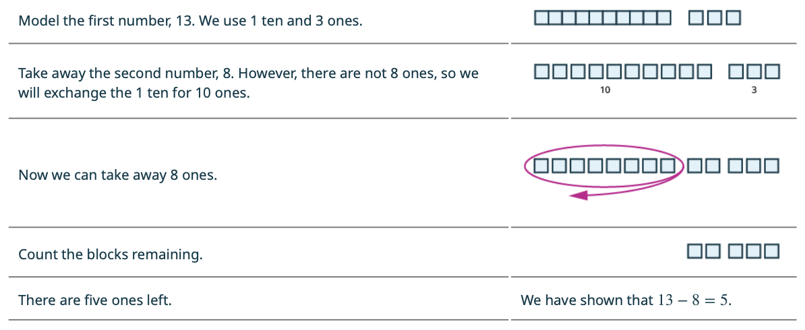

S:
**IDENTIFY**: Subtraction requiring regrouping

**EXECUTE**:
- Model 13: 1 ten, 3 ones
- Need to subtract 8 ones, but only have 3
- Exchange 1 ten for 10 ones (now 13 ones)
- Remove 8 ones
- Remaining: 5 ones

**EVALUATE**: 13 - 8 = 5 (regrouping required) ✓

P: Model 43 - 26.

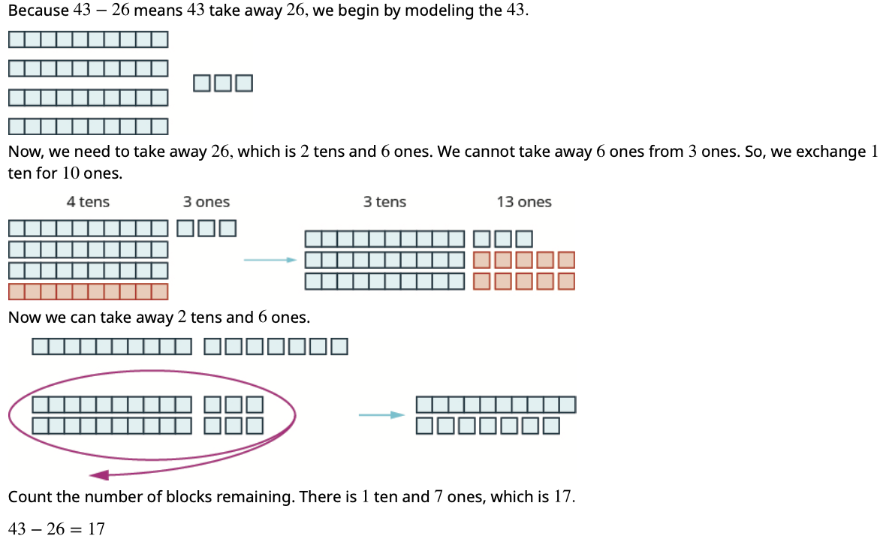

S:
**IDENTIFY**: Two-digit subtraction with regrouping

**EXECUTE**:
- Model 43: 4 tens, 3 ones
- Cannot subtract 6 from 3, so regroup
- Exchange 1 ten for 10 ones: 3 tens, 13 ones
- Remove 2 tens, 6 ones
- Remaining: 1 ten, 7 ones = 17

**EVALUATE**: 43 - 26 = 17 ✓

### Subtraction with Borrowing

P: Subtract 43 - 26.

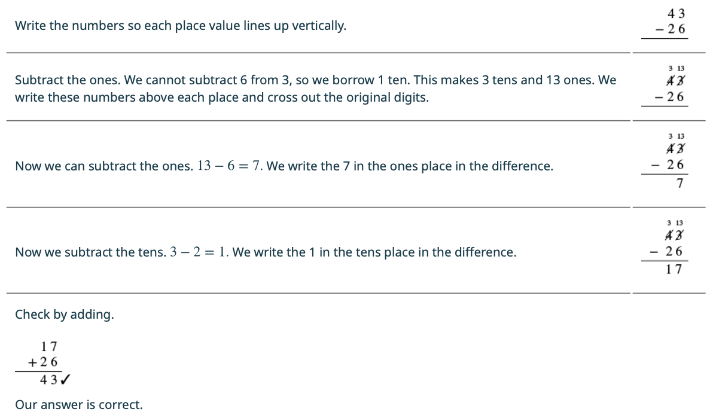

S:
**IDENTIFY**: Two-digit subtraction with borrowing

**EXECUTE**:
1. Cannot subtract 6 from 3 in ones place
2. Borrow 1 ten: 4 tens → 3 tens, 3 ones → 13 ones
3. Ones: 13 - 6 = 7
4. Tens: 3 - 2 = 1

**EVALUATE**: Check: 17 + 26 = 43 ✓

P: Subtract 910 - 586.

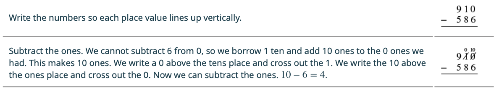
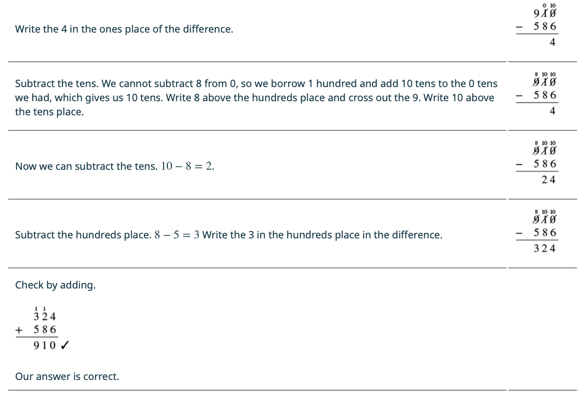

S:
**IDENTIFY**: Multiple borrowing required

**EXECUTE**:
1. Cannot subtract 6 from 0 ones: borrow from tens
2. Cannot borrow from 0 tens: borrow from hundreds
3. 9 hundreds → 8 hundreds, 0 tens → 10 tens
4. 10 tens → 9 tens, 0 ones → 10 ones
5. Ones: 10 - 6 = 4
6. Tens: 9 - 8 = 1 (after borrowing one more)
7. Hundreds: 8 - 5 = 3

**EVALUATE**: Check: 324 + 586 = 910 ✓

P: Subtract 2,162 - 479.

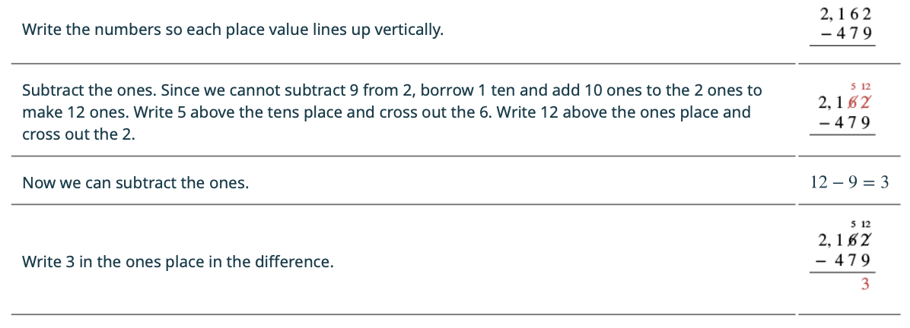
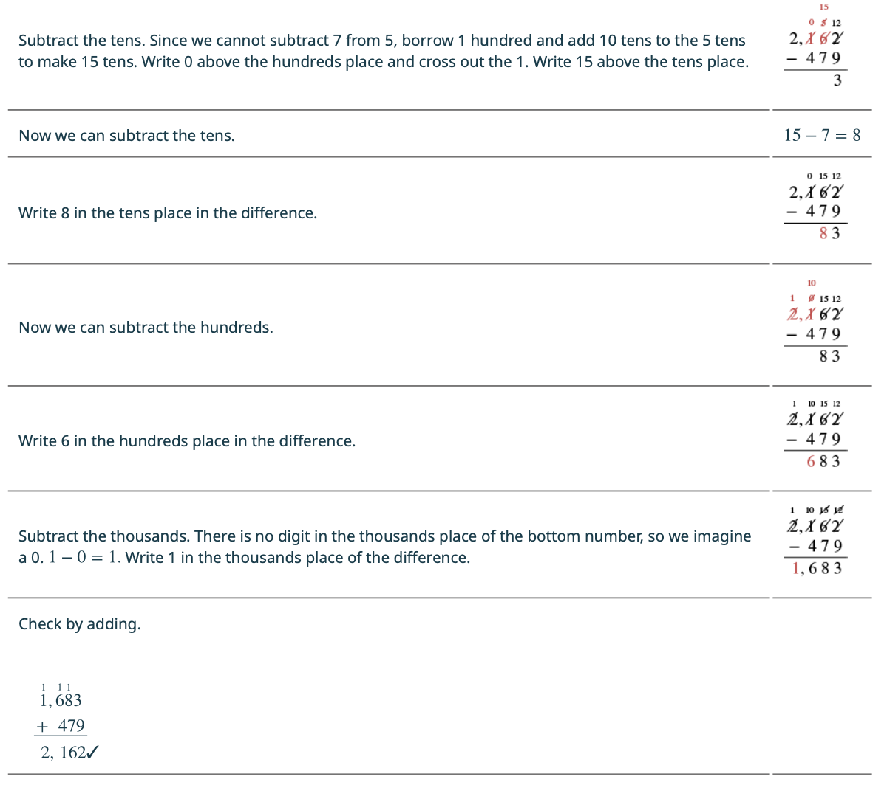

S:
**IDENTIFY**: Four-digit minus three-digit with borrowing

**EXECUTE**:
1. Ones: cannot subtract 9 from 2, borrow: 12 - 9 = 3
2. Tens: cannot subtract 7 from 5 (after borrow), borrow: 15 - 7 = 8
3. Hundreds: 10 - 4 = 6 (after borrow to tens)
4. Thousands: 1 - 0 = 1

**EVALUATE**: Check: 1,683 + 479 = 2,162 ✓

P: Subtract 207 - 64.

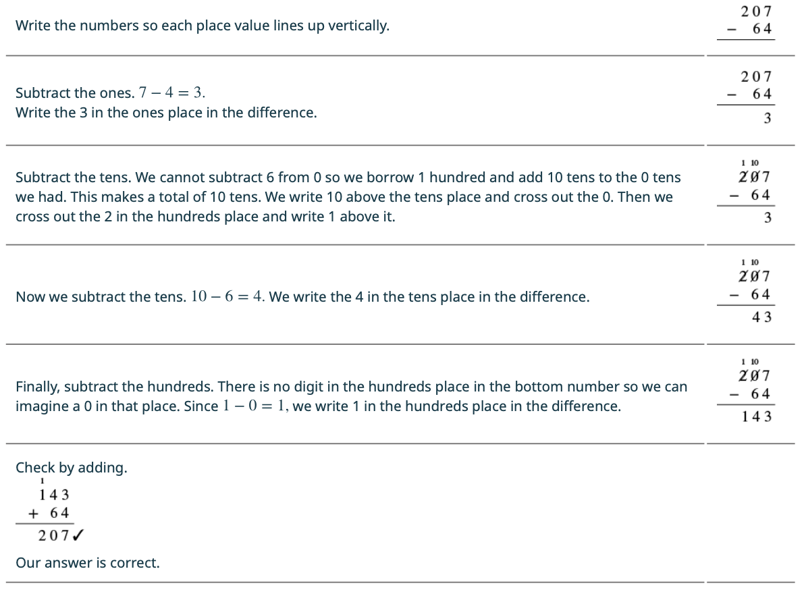

S:
**IDENTIFY**: Borrowing from hundreds when tens = 0

**EXECUTE**:
1. Ones: 7 - 4 = 3
2. Tens: cannot subtract 6 from 0, borrow from hundreds
3. 2 hundreds → 1 hundred, 0 tens → 10 tens
4. Tens: 10 - 6 = 4
5. Hundreds: 1 - 0 = 1

**EVALUATE**: Check: 143 + 64 = 207 ✓

### Word Phrases for Subtraction

Q: How do you translate "the difference of 13 and 8"?
A: 13 - 8 = 5. "Difference of" indicates subtraction, numbers stay in order given.

Q: How do you translate "subtract 24 from 43"?
A: 43 - 24 = 19. "Subtract...from" reverses the order: take 24 from 43.

Q: What does "18 less than 67" mean?
A: 67 - 18 = 49. "Less than" reverses order: start with 67, subtract 18.

### Applications

P: The temperature was 73°F in the morning and 27°F at noon. What is the difference?

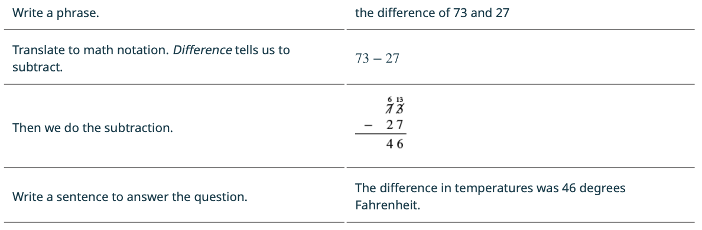

S:
**IDENTIFY**: Find difference between temperatures

**PLAN**: Difference means subtract: 73 - 27

**EXECUTE**: 73 - 27 = 46

**EVALUATE**: The difference in temperature was 46 degrees Fahrenheit ✓

P: A washing machine costs $588 regular price, on sale for $399. What is the difference?

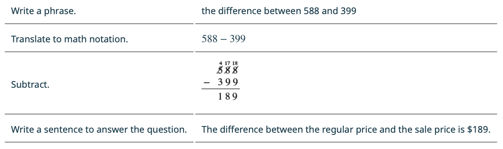

S:
**IDENTIFY**: Find price difference

**PLAN**: Difference = 588 - 399

**EXECUTE**: 588 - 399 = 189

**EVALUATE**: The difference is $189 ✓

## 1.4 Multiply Whole Numbers

### Multiplication Notation

C: In multiplication, each number being multiplied is called a [factor], and the result is called the [product].

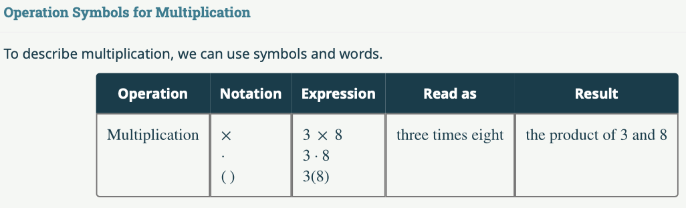

Q: What are three ways to write multiplication in mathematical notation?
A: Using ×, · (dot), or parentheses. For example: 3 × 8, 3 · 8, 3(8), or (3)(8) all mean "three times eight."

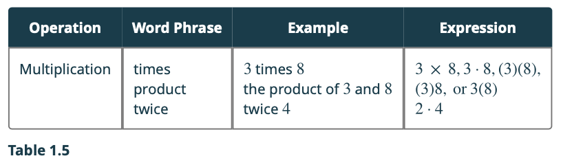

Q: What word phrases indicate multiplication?
A: Times, product, twice. Examples: "the product of 3 and 8" = 3 × 8; "twice 4" = 2 · 4.

### Modeling Multiplication

P: Model 3 × 8 using counters.

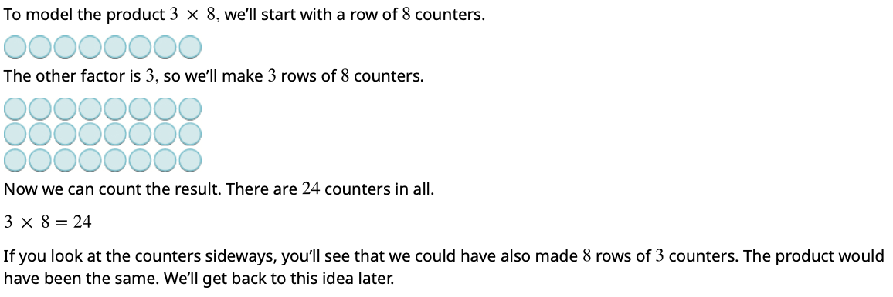

S:
**IDENTIFY**: Multiplication as repeated addition or array

**EXECUTE**:
- Create 3 rows of 8 counters each
- Count total counters
- Result: 24 counters

**EVALUATE**: 3 × 8 = 24 (could also be 8 rows of 3) ✓

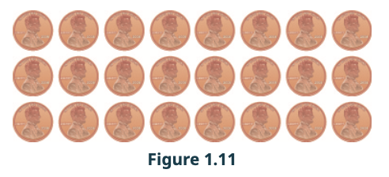

Q: How many pennies are in 3 rows of 8 pennies each?
A: 24 pennies. This demonstrates multiplication: 3 × 8 = 24.

### Multiplication Properties

C: The [Multiplication Property of Zero] states that the product of any number and 0 is 0: $a \cdot 0 = 0 \cdot a = 0$

Q: What is (42)(0)?
A: 0. The Multiplication Property of Zero states that any number times zero equals zero.

C: The [Identity Property of Multiplication] states that the product of any number and 1 is the number: $1 \cdot a = a \cdot 1 = a$

Q: What is 42 × 1?
A: 42. The Identity Property of Multiplication states that multiplying by 1 doesn't change the value.

C: The [Commutative Property of Multiplication] states that changing the order of factors does not change the product: $a \cdot b = b \cdot a$

Q: Why is 8 · 7 equal to 7 · 8?
A: The Commutative Property of Multiplication - changing the order of factors doesn't change the product. Both equal 56.

### Multiplication Algorithms

P: Multiply 15 × 4.

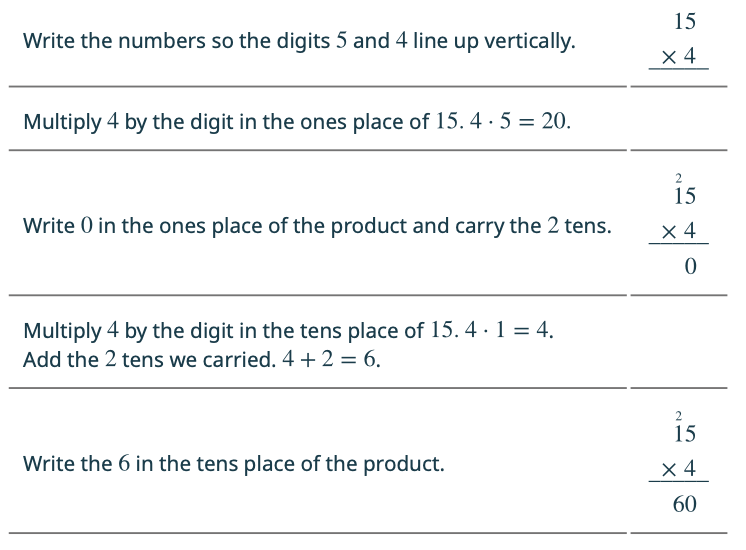

S:
**IDENTIFY**: Single-digit times two-digit

**EXECUTE**:
1. 4 × 5 = 20, write 0, carry 2
2. 4 × 1 = 4, add carried 2 = 6
3. Result: 60

**EVALUATE**: 15 × 4 = 60 ✓

P: Multiply 286 × 5.

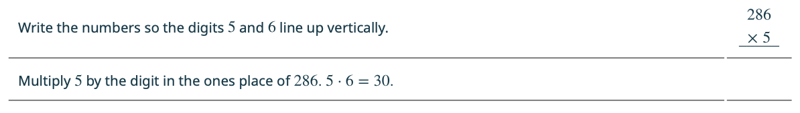
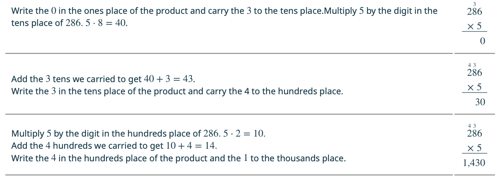

S:
**IDENTIFY**: Single-digit times three-digit

**EXECUTE**:
1. 5 × 6 = 30, write 0, carry 3
2. 5 × 8 = 40, add 3 = 43, write 3, carry 4
3. 5 × 2 = 10, add 4 = 14
4. Result: 1,430

**EVALUATE**: Check by estimation: 300 × 5 = 1,500 (close) ✓

P: Multiply 62 × 87.

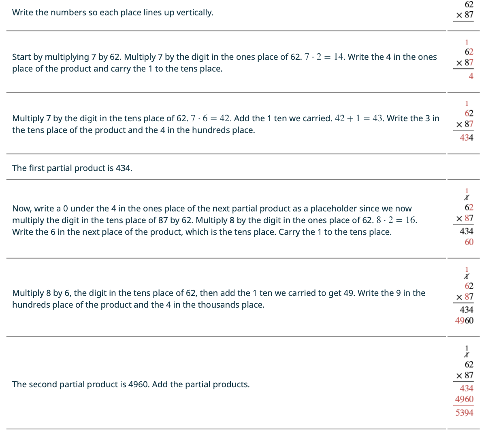

S:
**IDENTIFY**: Two-digit by two-digit multiplication

**EXECUTE**:
1. First partial product: 7 × 62 = 434
2. Second partial product: 80 × 62 = 4,960
3. Add partial products: 434 + 4,960 = 5,394

**EVALUATE**: 62 × 87 = 5,394 ✓

P: Multiply 47 × 10.

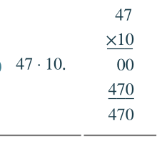

S:
**IDENTIFY**: Multiplying by 10

**PLAN**: Pattern: multiplying by 10 adds one zero

**EXECUTE**: 47 × 10 = 470

**EVALUATE**: One zero in 10, one zero after 47 ✓

P: Multiply 47 × 100.

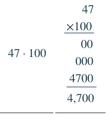

S:
**IDENTIFY**: Multiplying by 100

**PLAN**: Pattern: multiplying by 100 adds two zeros

**EXECUTE**: 47 × 100 = 4,700

**EVALUATE**: Two zeros in 100, two zeros after 47 ✓

P: Multiply 354 × 438.

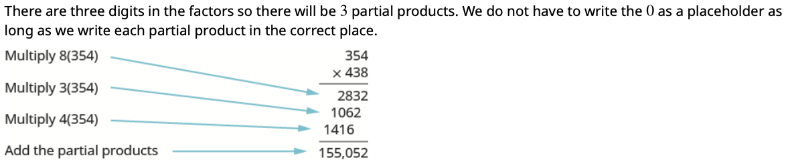

S:
**IDENTIFY**: Three-digit by three-digit

**EXECUTE**:
1. Partial product 1: 8 × 354 = 2,832
2. Partial product 2: 30 × 354 = 10,620
3. Partial product 3: 400 × 354 = 141,600
4. Add: 2,832 + 10,620 + 141,600 = 155,052

**EVALUATE**: Three digits means three partial products ✓

P: Multiply 896 × 201.

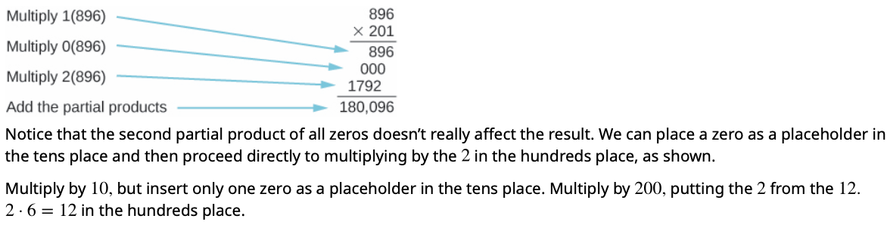

S:
**IDENTIFY**: Multiplying with zero in middle digit

**EXECUTE**:
1. 1 × 896 = 896
2. 0 × 896 = 0 (can use placeholder zero)
3. 200 × 896 = 179,200
4. Add: 896 + 179,200 = 180,096

**EVALUATE**: Zero in tens place simplifies calculation ✓

### Area Applications

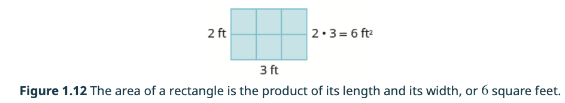

C: The area of a rectangle is the product of its [length] and [width], measured in square units.

Q: How do you find the area of a rectangle?
A: Multiply length × width. For a 2 ft by 3 ft rectangle: 2 · 3 = 6 square feet.

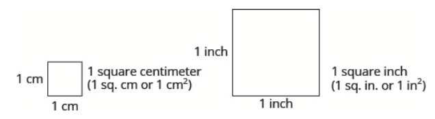

Q: What are common units for measuring area?
A: Square centimeters (cm²), square inches (in²), square feet (ft²), square meters (m²), square miles, etc.

P: Find the area of a kitchen ceiling 9 feet by 12 feet.

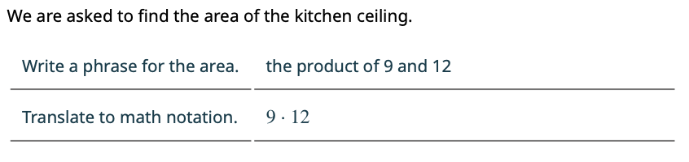
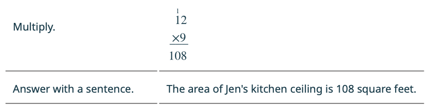

S:
**IDENTIFY**: Find area of rectangle

**PLAN**: Area = length × width = 9 · 12

**EXECUTE**: 9 × 12 = 108

**EVALUATE**: The area is 108 square feet ✓

### Word Phrases for Multiplication

P: Translate "the product of 12 and 27" to math notation and simplify.

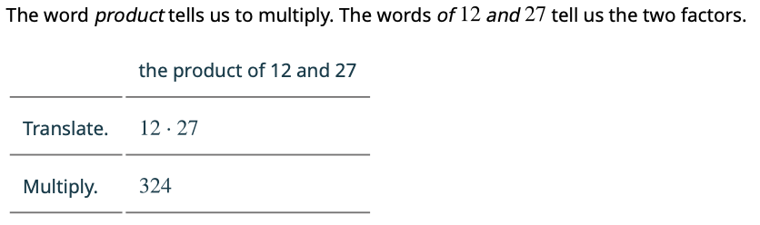

S:
**IDENTIFY**: "Product" indicates multiplication

**EXECUTE**: 12 · 27 = 324

**EVALUATE**: "Product of" means multiply the two numbers ✓

P: Translate "twice two hundred eleven" and simplify.

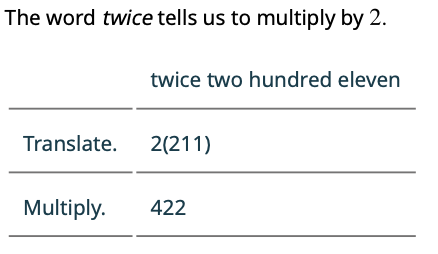

S:
**IDENTIFY**: "Twice" means multiply by 2

**EXECUTE**: 2(211) = 422

**EVALUATE**: "Twice" = 2 times ✓

P: Humberto bought 4 packs of 20 stamps. How many stamps total?

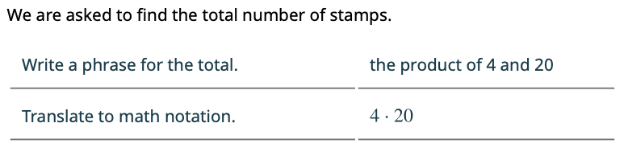
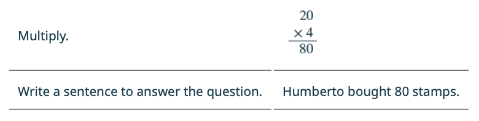

S:
**IDENTIFY**: Find total stamps

**PLAN**: Product of 4 and 20

**EXECUTE**: 4 · 20 = 80

**EVALUATE**: Humberto bought 80 stamps ✓

P: Rena uses twice as much water as rice. How much water for 4 cups rice?

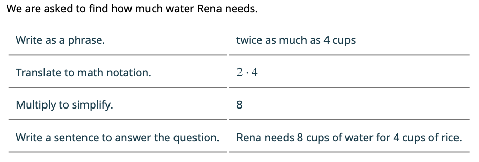

S:
**IDENTIFY**: "Twice as much" means multiply by 2

**PLAN**: 2 · 4

**EXECUTE**: 2 · 4 = 8

**EVALUATE**: Rena needs 8 cups of water ✓

P: Van needs 8 rows of 14 tiles. How many tiles total?

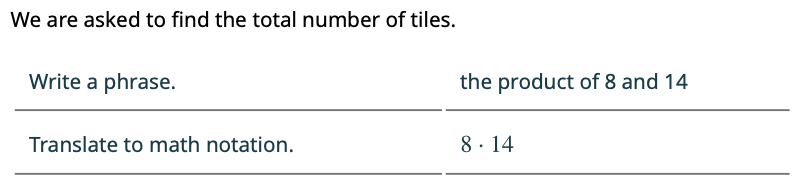

S:
**IDENTIFY**: Find total tiles (rows × tiles per row)

**PLAN**: Product of 8 and 14

**EXECUTE**: 8 · 14 = 112

**EVALUATE**: Van needs 112 tiles ✓

## 1.5 Divide Whole Numbers

### Division Notation

C: In division, the number being divided is the [dividend], the number dividing it is the [divisor], and the result is the [quotient].

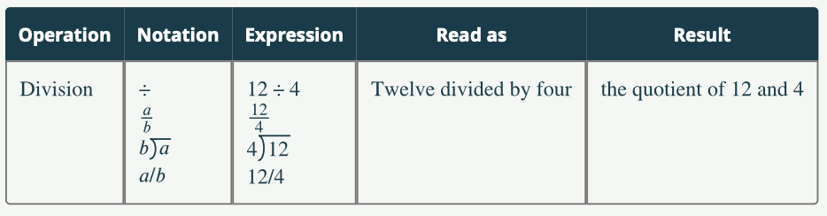

Q: What are four ways to write "twelve divided by four" in mathematical notation?
A: $12 \div 4$, $\frac{12}{4}$, $12/4$, or $4\overline{)12}$. All mean "twelve divided by four" with quotient 3.

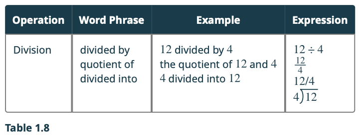

Q: What word phrases indicate division?
A: Divided by, quotient of, divided into. Example: "the quotient of 12 and 4" = $12 \div 4$.

### Modeling Division

P: Model 24 ÷ 8 using counters.

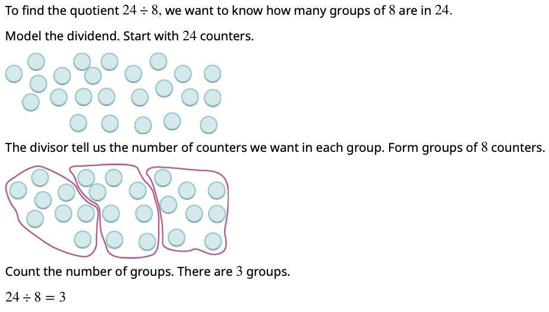

S:
**IDENTIFY**: How many groups of 8 in 24?

**EXECUTE**:
- Start with 24 counters
- Form groups of 8
- Count groups: 3 groups

**EVALUATE**: 24 ÷ 8 = 3 ✓

Q: If 12 cookies are divided into bags of 4, how many bags?
A: 3 bags. This shows division: 12 ÷ 4 = 3.

### Division Properties

C: [Division Property of One]: Any number (except 0) divided by itself is [1]: $a \div a = 1$

C: Any number divided by 1 equals [the number]: $a \div 1 = a$

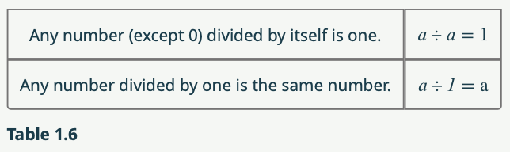

Q: What is 11 ÷ 11?
A: 1. Any number (except 0) divided by itself equals 1.

Q: What is 17 ÷ 1?
A: 17. Any number divided by 1 equals itself.

C: [Division Property of Zero]: Zero divided by any number (except 0) is [0]: $0 \div a = 0$

C: Division by zero is [undefined]: $a \div 0$ is undefined

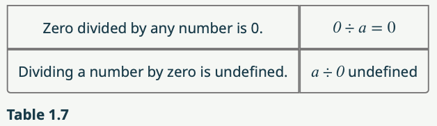

Q: What is 0 ÷ 3?
A: 0. Zero divided by any number equals zero.

Q: Why is 10 ÷ 0 undefined?
A: There's no number you can multiply by 0 to get 10 (since 0 times anything is 0). Division by zero is undefined.

### Long Division

P: Divide 78 ÷ 3 using long division.

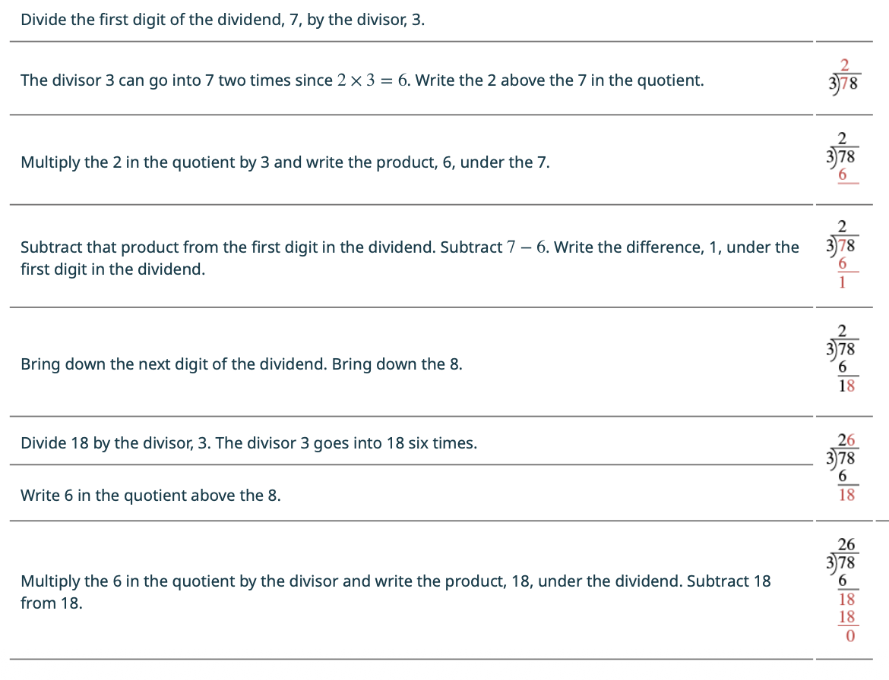

S:
**IDENTIFY**: Two-digit divided by one-digit

**EXECUTE**:
1. 3 into 7 goes 2 times (2 × 3 = 6)
2. Subtract: 7 - 6 = 1
3. Bring down 8 to make 18
4. 3 into 18 goes 6 times (6 × 3 = 18)
5. Subtract: 18 - 18 = 0

**EVALUATE**: Check: 26 × 3 = 78 ✓

P: Divide 2,596 ÷ 4.

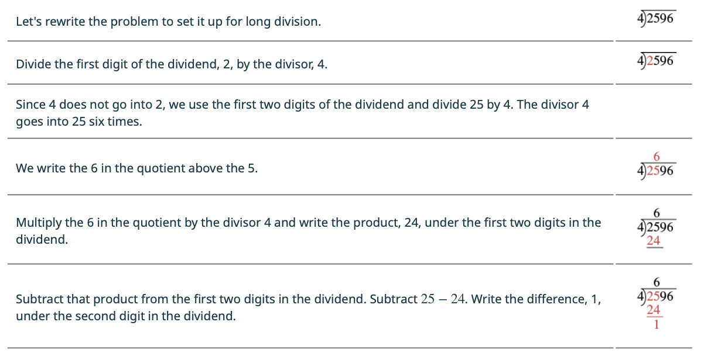

S:
**IDENTIFY**: Four-digit divided by one-digit

**EXECUTE**:
1. 4 doesn't go into 2, use 25
2. 4 into 25 goes 6 times, remainder 1
3. Bring down 9: 4 into 19 goes 4 times, remainder 3
4. Bring down 6: 4 into 36 goes 9 times exactly
5. Quotient: 649

**EVALUATE**: Check: 649 × 4 = 2,596 ✓

P: Divide 4,506 ÷ 6.

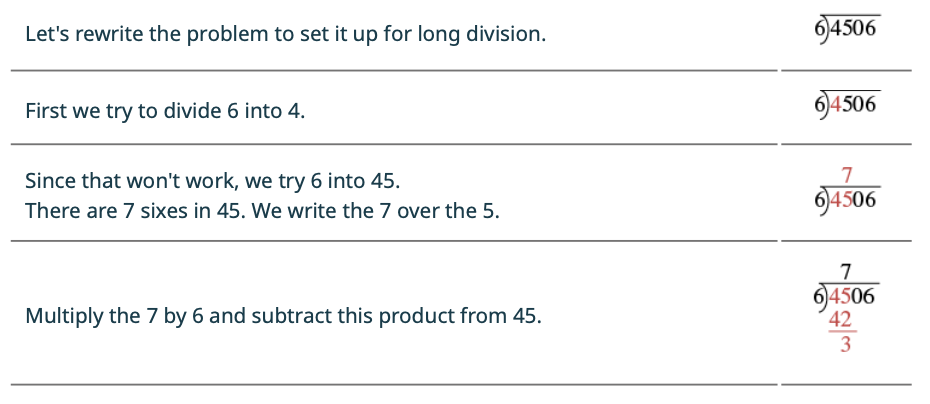
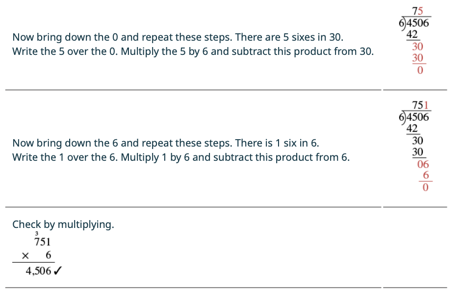

S:
**IDENTIFY**: Division with zero in quotient

**EXECUTE**:
1. 6 doesn't go into 4, use 45
2. 6 into 45 goes 7 times, remainder 3
3. Bring down 0: 6 doesn't go into 30, write 0 placeholder
4. Bring down 6: 6 into 36 goes 6 times exactly
5. Quotient: 751

**EVALUATE**: Check: 751 × 6 = 4,506 ✓

P: Divide 7,263 ÷ 9.

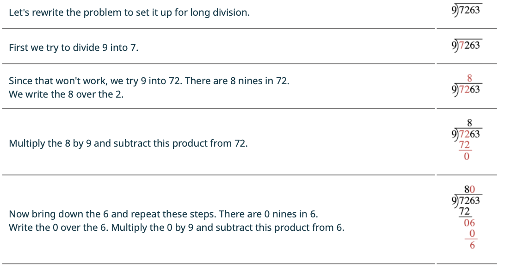
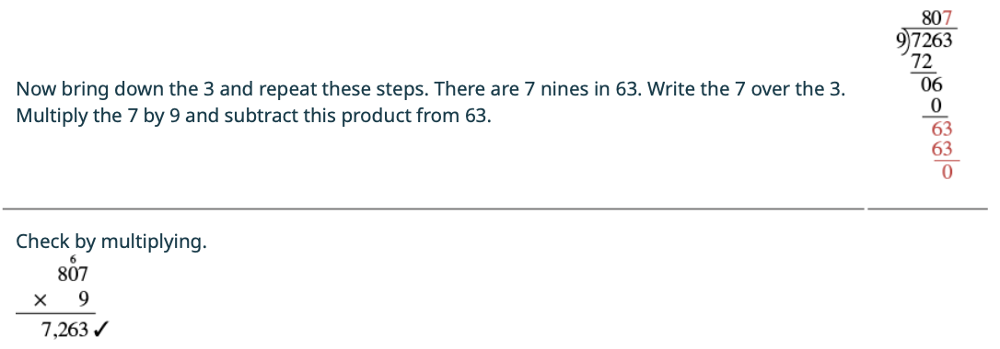

S:
**IDENTIFY**: Four-digit divided by one-digit with zero

**EXECUTE**:
1. 9 into 72 goes 8 times (72 - 72 = 0)
2. Bring down 6: 9 doesn't go into 6, write 0
3. Bring down 3: 9 into 63 goes 7 times exactly
4. Quotient: 807

**EVALUATE**: Check: 807 × 9 = 7,263 ✓

### Division with Remainders

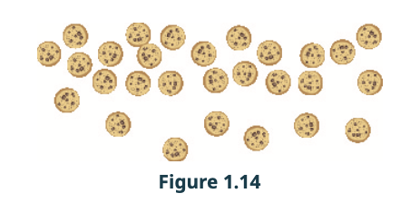
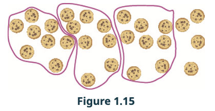

Q: What does division represent when dividing 35 cookies into groups of 5?
A: Creating equal groups. 35 ÷ 5 = 7 groups with 5 cookies in each group (demonstrated by circling cookies).

P: Divide 1,439 ÷ 4.

S:
**IDENTIFY**: Division with remainder

**EXECUTE**:
1. 4 into 14 goes 3 times, remainder 2
2. Bring down 3: 4 into 23 goes 5 times, remainder 3
3. Bring down 9: 4 into 39 goes 9 times, remainder 3
4. Quotient: 359 R3

**EVALUATE**: Check: (359 × 4) + 3 = 1,436 + 3 = 1,439 ✓

P: Divide 1,461 ÷ 13.

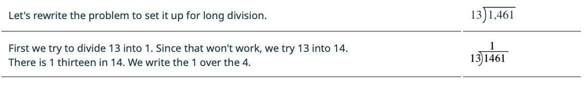
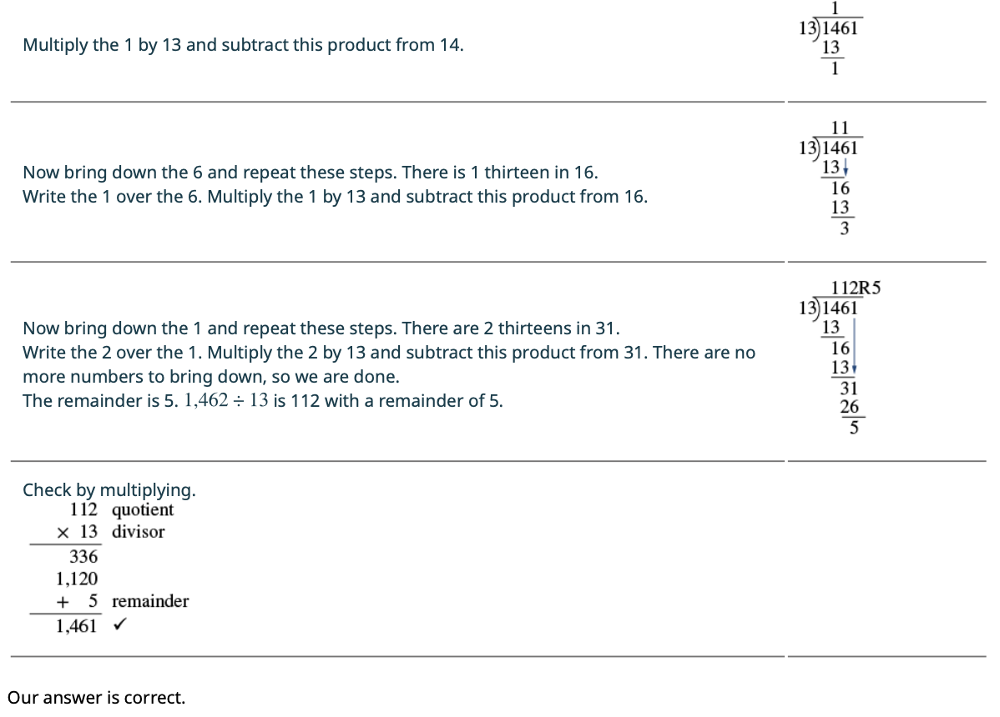

S:
**IDENTIFY**: Two-digit divisor

**EXECUTE**:
1. 13 into 14 goes 1 time, remainder 1
2. Bring down 6: 13 into 16 goes 1 time, remainder 3
3. Bring down 1: 13 into 31 goes 2 times, remainder 5
4. Quotient: 112 R5

**EVALUATE**: Check: (112 × 13) + 5 = 1,456 + 5 = 1,461 ✓

P: Divide 74,521 ÷ 241.

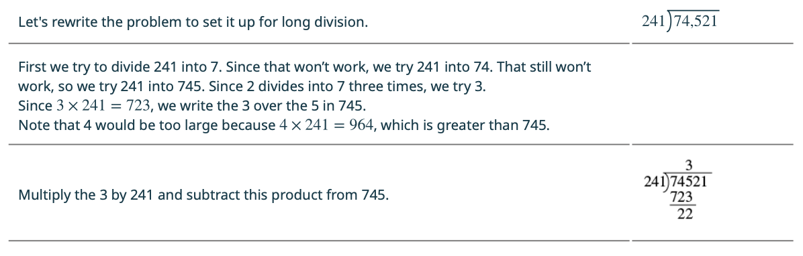
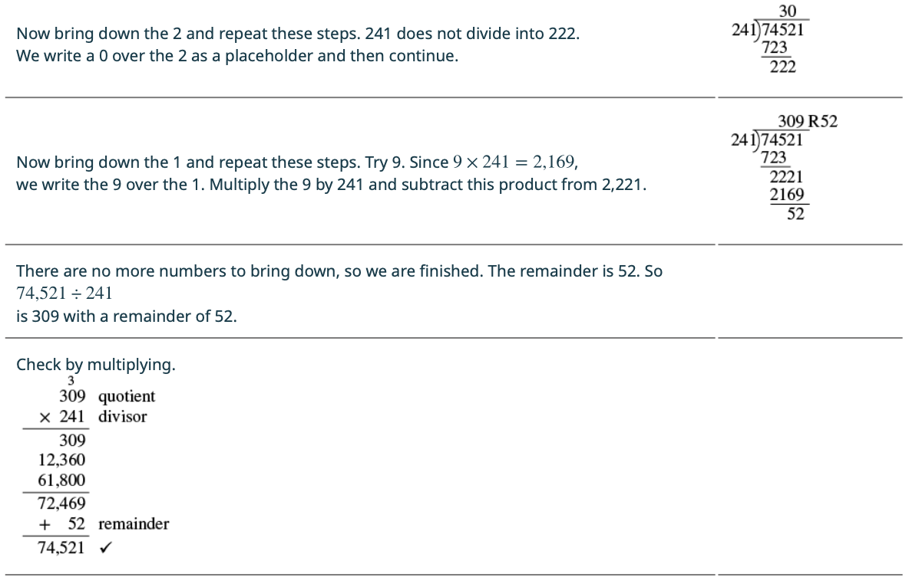

S:
**IDENTIFY**: Three-digit divisor requiring estimation

**EXECUTE**:
1. 241 into 745: try 3 (3 × 241 = 723 ✓, 4 × 241 = 964 too large)
2. Subtract: 745 - 723 = 22, bring down 2
3. 241 doesn't go into 222, write 0 placeholder
4. Bring down 1: 241 into 2,221: try 9 (9 × 241 = 2,169)
5. Remainder: 2,221 - 2,169 = 52
6. Quotient: 309 R52

**EVALUATE**: Check: (309 × 241) + 52 = 74,469 + 52 = 74,521 ✓

### Applications

P: Cecelia has 160 ounces of oatmeal. How many 8-ounce servings can she make?

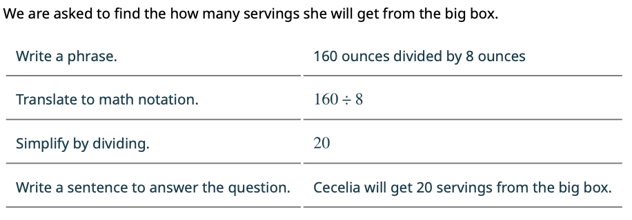

S:
**IDENTIFY**: Find number of servings

**PLAN**: 160 ounces divided by 8 ounces

**EXECUTE**: 160 ÷ 8 = 20

**EVALUATE**: Cecelia will get 20 servings ✓

# Chapter 1: Whole Numbers - Review Exercises and Practice Test

## 1.2 Add Whole Numbers

### Addition Properties and Notation

C: In addition notation, the expression $3 + 4$ is read as [three plus four], and the result is called the [sum of 3 and 4].

C: The [Identity Property of Addition] states that the sum of any number $a$ and 0 is the number: $a + 0 = 0 + a = a$.

C: The [Commutative Property of Addition] states that changing the order of addends $a$ and $b$ does not change their sum: $a + b = b + a$.

Q: What are the three main steps for adding whole numbers vertically?
A: (1) Write numbers with place values aligned vertically, (2) Add digits in each place value from right to left starting with ones, carrying if sum > 9, (3) Continue adding each place value, carrying as needed.

### Addition Practice Problems

P: Add: $0 + 19$

S:
**IDENTIFY**: Addition with zero (identity property)

**EXECUTE**: $0 + 19 = 19$

**EVALUATE**: Identity property: adding zero doesn't change the number ✓

P: Add: $7 + 6$

S:
**IDENTIFY**: Single-digit addition

**EXECUTE**: $7 + 6 = 13$

**EVALUATE**: Commutative property: $6 + 7 = 13$ also ✓

P: Add: $44 + 35$

S:
**IDENTIFY**: Two-digit addition with carrying

**EXECUTE**:
- Ones: $4 + 5 = 9$
- Tens: $4 + 3 = 7$
- Result: $79$

**EVALUATE**: $44 + 35 = 79$ ✓

P: Add: $96 + 58$

S:
**IDENTIFY**: Two-digit addition with carrying

**EXECUTE**:
- Ones: $6 + 8 = 14$, write 4 carry 1
- Tens: $1 + 9 + 5 = 15$, write 15
- Result: $154$

**EVALUATE**: $96 + 58 = 154$ ✓

P: Add: $375 + 591$

S:
**IDENTIFY**: Three-digit addition with carrying

**EXECUTE**:
- Ones: $5 + 1 = 6$
- Tens: $7 + 9 = 16$, write 6 carry 1
- Hundreds: $1 + 3 + 5 = 9$
- Result: $966$

**EVALUATE**: $375 + 591 = 966$ ✓

P: Add: $7,281 + 12,546$

S:
**IDENTIFY**: Multi-digit addition with carrying

**EXECUTE**:
- Ones: $1 + 6 = 7$
- Tens: $8 + 4 = 12$, write 2 carry 1
- Hundreds: $1 + 2 + 5 = 8$
- Thousands: $7 + 2 = 9$
- Ten-thousands: $1 + 0 = 1$
- Result: $19,827$

**EVALUATE**: $7,281 + 12,546 = 19,827$ ✓

P: Add: $5,280 + 16,324 + 9,731$

S:
**IDENTIFY**: Three-number addition with carrying

**EXECUTE**:
- Ones: $0 + 4 + 1 = 5$
- Tens: $8 + 2 + 3 = 13$, write 3 carry 1
- Hundreds: $1 + 2 + 3 + 7 = 13$, write 3 carry 1
- Thousands: $1 + 5 + 6 + 9 = 21$, write 1 carry 2
- Ten-thousands: $2 + 1 = 3$
- Result: $31,335$

**EVALUATE**: $5,280 + 16,324 + 9,731 = 31,335$ ✓

### Addition Word Problems

Q: How do you translate "the sum of 30 and 12" into mathematical notation?
A: $30 + 12$. The word "sum" indicates addition.

Q: How do you translate "11 increased by 8" into mathematical notation?
A: $11 + 8$. The phrase "increased by" indicates addition.

Q: How do you translate "25 more than 39" into mathematical notation?
A: $39 + 25$. The phrase "more than" indicates addition (note the order reversal).

Q: How do you translate "total of 15 and 50" into mathematical notation?
A: $15 + 50$. The word "total" indicates addition.

P: Shopping for an interview: Nathan bought a shirt (\$24), tie (\$14), and slacks (\$38). What was Nathan's total cost?

S:
**IDENTIFY**: Addition word problem (finding total cost)

**PLAN**: Add all three costs: $24 + 14 + 38$

**EXECUTE**:
- $24 + 14 = 38$
- $38 + 38 = 76$

**EVALUATE**: Nathan's total cost was \$76 ✓

P: Running: Jackson ran 4 miles Monday, 12 miles Tuesday, 1 mile Wednesday, 8 miles Thursday, and 5 miles Friday. What was the total number of miles?

S:
**IDENTIFY**: Addition word problem (finding total distance)

**PLAN**: Add all distances: $4 + 12 + 1 + 8 + 5$

**EXECUTE**:
- $4 + 12 = 16$
- $16 + 1 = 17$
- $17 + 8 = 25$
- $25 + 5 = 30$

**EVALUATE**: Jackson ran 30 miles total ✓

P: Find the perimeter of the right triangle with sides 5 cm, 13 cm, and 12 cm.

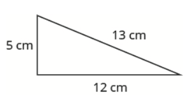

S:
**IDENTIFY**: Perimeter problem (sum of all sides)

**PLAN**: Add all three sides: $5 + 13 + 12$

**EXECUTE**: $5 + 13 + 12 = 30$ cm

**EVALUATE**: Perimeter = 30 cm ✓

P: Find the perimeter of the rectangle with dimensions 19 ft by 14 ft.

S:
**IDENTIFY**: Rectangle perimeter problem

**PLAN**: Perimeter = $2 \times \text{length} + 2 \times \text{width}$ or add all four sides

**EXECUTE**: $19 + 14 + 19 + 14 = 66$ ft

**EVALUATE**: Perimeter = 66 ft ✓

## 1.3 Subtract Whole Numbers

### Subtraction Properties and Notation

C: In subtraction notation, the expression $7 - 3$ is read as [seven minus three], and the result is called the [difference of 7 and 3].

Q: What are the four main steps for subtracting whole numbers vertically?
A: (1) Write numbers with place values aligned vertically, (2) Subtract digits in each place value from right to left starting with ones, borrowing if needed, (3) Continue subtracting each place value, borrowing as needed, (4) Check by adding.

### Subtraction Practice Problems

P: Subtract: $8 - 5$

S:
**IDENTIFY**: Single-digit subtraction

**EXECUTE**: $8 - 5 = 3$

**EVALUATE**: Check: $3 + 5 = 8$ ✓

P: Subtract: $12 - 7$

S:
**IDENTIFY**: Single-digit subtraction

**EXECUTE**: $12 - 7 = 5$

**EVALUATE**: Check: $5 + 7 = 12$ ✓

P: Subtract: $23 - 9$

S:
**IDENTIFY**: Two-digit subtraction with borrowing

**EXECUTE**:
- Cannot subtract 9 from 3
- Borrow 1 ten: $13 - 9 = 4$
- Tens: $1 - 0 = 1$
- Result: $14$

**EVALUATE**: Check: $14 + 9 = 23$ ✓

P: Subtract: $46 - 21$

S:
**IDENTIFY**: Two-digit subtraction without borrowing

**EXECUTE**:
- Ones: $6 - 1 = 5$
- Tens: $4 - 2 = 2$
- Result: $25$

**EVALUATE**: Check: $25 + 21 = 46$ ✓

P: Subtract: $82 - 59$

S:
**IDENTIFY**: Two-digit subtraction with borrowing

**EXECUTE**:
- Cannot subtract 9 from 2, borrow: $12 - 9 = 3$
- Tens: $7 - 5 = 2$
- Result: $23$

**EVALUATE**: Check: $23 + 59 = 82$ ✓

P: Subtract: $110 - 87$

S:
**IDENTIFY**: Three-digit subtraction with borrowing

**EXECUTE**:
- Cannot subtract 7 from 0, borrow: $10 - 7 = 3$
- Cannot subtract 8 from 0, borrow: $10 - 8 = 2$
- Hundreds: $0 - 0 = 0$
- Result: $23$

**EVALUATE**: Check: $23 + 87 = 110$ ✓

P: Subtract: $539 - 217$

S:
**IDENTIFY**: Three-digit subtraction

**EXECUTE**:
- Ones: $9 - 7 = 2$
- Tens: $3 - 1 = 2$
- Hundreds: $5 - 2 = 3$
- Result: $322$

**EVALUATE**: Check: $322 + 217 = 539$ ✓

P: Subtract: $415 - 296$

S:
**IDENTIFY**: Three-digit subtraction with borrowing

**EXECUTE**:
- Cannot subtract 6 from 5, borrow: $15 - 6 = 9$
- Cannot subtract 9 from 0, borrow: $10 - 9 = 1$
- Hundreds: $3 - 2 = 1$
- Result: $119$

**EVALUATE**: Check: $119 + 296 = 415$ ✓

P: Subtract: $1,020 - 640$

S:
**IDENTIFY**: Four-digit subtraction

**EXECUTE**:
- Ones: $0 - 0 = 0$
- Tens: $2 - 4$ cannot do, borrow: $12 - 4 = 8$
- Hundreds: $9 - 6 = 3$
- Thousands: $1 - 0 = 1$
- Result: $380$

**EVALUATE**: Check: $380 + 640 = 1,020$ ✓

P: Subtract: $8,355 - 3,947$

S:
**IDENTIFY**: Four-digit subtraction with multiple borrowings

**EXECUTE**:
- Ones: $15 - 7 = 8$ (borrowed)
- Tens: $4 - 4 = 0$ (after borrowing)
- Hundreds: $2 - 9$ cannot do, borrow: $12 - 9 = 3$
- Thousands: $7 - 3 = 4$
- Result: $4,408$

**EVALUATE**: Check: $4,408 + 3,947 = 8,355$ ✓

P: Subtract: $10,000 - 15$

S:
**IDENTIFY**: Subtraction with many zeros requiring borrowing

**EXECUTE**:
- Ones: $10 - 5 = 5$ (after borrowing)
- Tens: $9 - 1 = 8$ (after borrowing)
- Hundreds: $9 - 0 = 9$
- Thousands: $9 - 0 = 9$
- Ten-thousands: $1 - 0 = 1$
- Result: $9,985$

**EVALUATE**: Check: $9,985 + 15 = 10,000$ ✓

P: Subtract: $54,925 - 35,647$

S:
**IDENTIFY**: Five-digit subtraction with borrowing

**EXECUTE**:
- Ones: $15 - 7 = 8$ (borrowed)
- Tens: $1 - 4$ cannot do, borrow: $11 - 4 = 7$
- Hundreds: $8 - 6 = 2$
- Thousands: $4 - 5$ cannot do, borrow: $14 - 5 = 9$
- Ten-thousands: $4 - 3 = 1$
- Result: $19,278$

**EVALUATE**: Check: $19,278 + 35,647 = 54,925$ ✓

### Subtraction Word Problems

Q: How do you translate "the difference of nineteen and thirteen" into mathematical notation?
A: $19 - 13$. The word "difference" indicates subtraction.

Q: How do you translate "subtract sixty-five from one hundred" into mathematical notation?
A: $100 - 65$. "Subtract A from B" means $B - A$ (note the order).

Q: How do you translate "seventy-four decreased by eight" into mathematical notation?
A: $74 - 8$. The phrase "decreased by" indicates subtraction.

Q: How do you translate "twenty-three less than forty-one" into mathematical notation?
A: $41 - 23$. "A less than B" means $B - A$ (note the order reversal).

P: Temperature: The high temperature in Peoria was 86°F and the low was 28°F. What was the difference between the high and low temperatures?

S:
**IDENTIFY**: Subtraction word problem (finding difference)

**PLAN**: Subtract low from high: $86 - 28$

**EXECUTE**: $86 - 28 = 58$

**EVALUATE**: The difference was 58 degrees Fahrenheit ✓

P: Savings: Lynn wants a cruise costing \$2,485. She has \$948 saved. How much more does she need?

S:
**IDENTIFY**: Subtraction word problem (finding remaining amount)

**PLAN**: Subtract savings from cost: $2,485 - 948$

**EXECUTE**:
- Ones: $5 - 8$ cannot do, borrow: $15 - 8 = 7$
- Tens: $7 - 4 = 3$
- Hundreds: $4 - 9$ cannot do, borrow: $14 - 9 = 5$
- Thousands: $1 - 0 = 1$
- Result: $1,537$

**EVALUATE**: Lynn needs \$1,537 more ✓

## 1.4 Multiply Whole Numbers

### Multiplication Properties and Notation

C: In multiplication, different symbols can be used: the cross [$\times$], the dot [$\cdot$], and [parentheses ()]. All represent multiplication.

C: The [Multiplication Property of Zero] states that the product of any number and 0 is 0: $a \cdot 0 = 0$ and $0 \cdot a = 0$.

C: The [Identity Property of Multiplication] states that the product of any number and 1 is the number: $1 \cdot a = a$ and $a \cdot 1 = a$.

C: The [Commutative Property of Multiplication] states that changing the order of factors does not change their product: $a \cdot b = b \cdot a$.

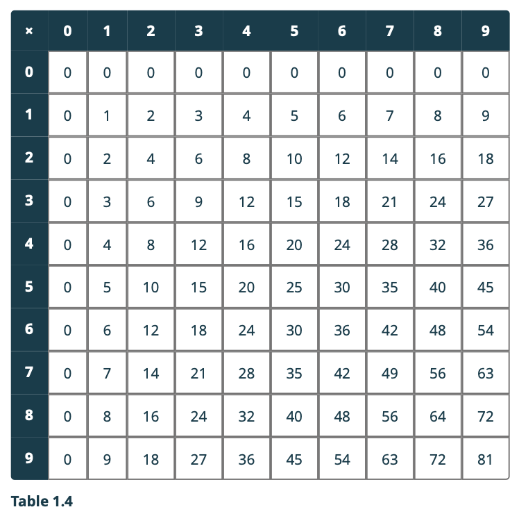

Q: What are the key steps for multiplying two whole numbers vertically?
A: (1) Write numbers with place values aligned, (2) Multiply bottom number by each digit of top number from right to left, (3) Carry if product > 9, (4) Write partial products with proper place value alignment (insert zero placeholders), (5) Add partial products.

### Multiplication Practice Problems

P: Multiply: $0 \cdot 14$

S:
**IDENTIFY**: Multiplication by zero

**EXECUTE**: $0 \cdot 14 = 0$

**EVALUATE**: Zero property: any number times 0 equals 0 ✓

P: Multiply: $(256) \cdot 0$

S:
**IDENTIFY**: Multiplication by zero

**EXECUTE**: $(256) \cdot 0 = 0$

**EVALUATE**: Zero property applies ✓

P: Multiply: $1 \cdot 99$

S:
**IDENTIFY**: Multiplication by one (identity property)

**EXECUTE**: $1 \cdot 99 = 99$

**EVALUATE**: Identity property: multiplying by 1 doesn't change the number ✓

P: Multiply: $(4,789) \cdot 1$

S:
**IDENTIFY**: Multiplication by one (identity property)

**EXECUTE**: $(4,789) \cdot 1 = 4,789$

**EVALUATE**: Identity property applies ✓

P: Multiply: $7 \cdot 4$

S:
**IDENTIFY**: Single-digit multiplication

**EXECUTE**: $7 \cdot 4 = 28$

**EVALUATE**: Commutative property: $4 \cdot 7 = 28$ also ✓

P: Multiply: $(25) \cdot (6)$

S:
**IDENTIFY**: Two-digit by one-digit multiplication

**EXECUTE**:
- $6 \times 5 = 30$, write 0 carry 3
- $6 \times 2 = 12$, add 3 = 15
- Result: $150$

**EVALUATE**: $25 \times 6 = 150$ ✓

P: Multiply: $9,261 \times 3$

S:
**IDENTIFY**: Four-digit by one-digit multiplication

**EXECUTE**:
- $3 \times 1 = 3$
- $3 \times 6 = 18$, write 8 carry 1
- $3 \times 2 = 6$, add 1 = 7
- $3 \times 9 = 27$
- Result: $27,783$

**EVALUATE**: $9,261 \times 3 = 27,783$ ✓

P: Multiply: $48 \cdot 76$

S:
**IDENTIFY**: Two-digit by two-digit multiplication

**EXECUTE**:
- First partial product: $6 \times 48 = 288$
- Second partial product: $70 \times 48 = 3,360$
- Add: $288 + 3,360 = 3,648$

**EVALUATE**: $48 \times 76 = 3,648$ ✓

P: Multiply: $64 \cdot 10$

S:
**IDENTIFY**: Multiplication by 10

**EXECUTE**: $64 \times 10 = 640$

**EVALUATE**: Multiplying by 10 appends one zero ✓

P: Multiply: $1,000 \times 22$

S:
**IDENTIFY**: Multiplication by 1,000

**EXECUTE**: $1,000 \times 22 = 22,000$

**EVALUATE**: Multiplying by 1,000 appends three zeros ✓

P: Multiply: $162 \times 493$

S:
**IDENTIFY**: Three-digit by three-digit multiplication

**EXECUTE**:
- First partial product: $3 \times 162 = 486$
- Second partial product: $90 \times 162 = 14,580$
- Third partial product: $400 \times 162 = 64,800$
- Add: $486 + 14,580 + 64,800 = 79,866$

**EVALUATE**: $162 \times 493 = 79,866$ ✓

P: Multiply: $(601) \times (943)$

S:
**IDENTIFY**: Three-digit by three-digit multiplication with zero

**EXECUTE**:
- First partial product: $3 \times 601 = 1,803$
- Second partial product: $40 \times 601 = 24,040$
- Third partial product: $900 \times 601 = 540,900$
- Add: $1,803 + 24,040 + 540,900 = 566,743$

**EVALUATE**: $601 \times 943 = 566,743$ ✓

P: Multiply: $3,624 \times 517$

S:
**IDENTIFY**: Four-digit by three-digit multiplication

**EXECUTE**:
- First partial product: $7 \times 3,624 = 25,368$
- Second partial product: $10 \times 3,624 = 36,240$
- Third partial product: $500 \times 3,624 = 1,812,000$
- Add: $25,368 + 36,240 + 1,812,000 = 1,873,608$

**EVALUATE**: $3,624 \times 517 = 1,873,608$ ✓

P: Multiply: $10,538 \cdot 22$

S:
**IDENTIFY**: Five-digit by two-digit multiplication

**EXECUTE**:
- First partial product: $2 \times 10,538 = 21,076$
- Second partial product: $20 \times 10,538 = 210,760$
- Add: $21,076 + 210,760 = 231,836$

**EVALUATE**: $10,538 \times 22 = 231,836$ ✓

### Multiplication Word Problems

Q: How do you translate "the product of 15 and 28" into mathematical notation?
A: $15 \times 28$. The word "product" indicates multiplication.

Q: How do you translate "ninety-four times thirty-three" into mathematical notation?
A: $94 \times 33$. The word "times" indicates multiplication.

Q: How do you translate "twice 575" into mathematical notation?
A: $2 \times 575$. The word "twice" means multiply by 2.

Q: How do you translate "ten times two hundred sixty-four" into mathematical notation?
A: $10 \times 264$. The word "times" indicates multiplication.

P: Gardening: Geniece bought 8 packs of marigolds. Each pack has 6 flowers. How many marigolds did Geniece buy?

S:
**IDENTIFY**: Multiplication word problem (groups of equal size)

**PLAN**: Multiply packs by flowers per pack: $8 \times 6$

**EXECUTE**: $8 \times 6 = 48$

**EVALUATE**: Geniece bought 48 marigolds ✓

P: Cooking: Ratika makes rice using twice as much water as rice. If she uses 4 cups of rice, how many cups of water does she need?

S:
**IDENTIFY**: Multiplication word problem (twice means multiply by 2)

**PLAN**: Multiply rice amount by 2: $2 \times 4$

**EXECUTE**: $2 \times 4 = 8$

**EVALUATE**: Ratika needs 8 cups of water ✓

P: Multiplex: There are 12 theaters, each with 150 seats. What is the total number of seats?

S:
**IDENTIFY**: Multiplication word problem (finding total)

**PLAN**: Multiply theaters by seats per theater: $12 \times 150$

**EXECUTE**: $12 \times 150 = 1,800$

**EVALUATE**: Total of 1,800 seats ✓

P: Roofing: Lewis needs shingles for a rectangular roof 30 feet by 24 feet. What is the area of the roof?

S:
**IDENTIFY**: Area problem (rectangle area = length × width)

**PLAN**: Multiply length by width: $30 \times 24$

**EXECUTE**: $30 \times 24 = 720$

**EVALUATE**: Area = 720 square feet ✓

## 1.5 Divide Whole Numbers

### Division Properties and Notation

C: Division can be written in several ways: [$\div$], [$\frac{a}{b}$], [$b\overline{)a}$], and as a fraction. All represent "a divided by b".

C: The [Division Properties of One] state: (1) Any number (except 0) divided by itself is 1: $a \div a = 1$, and (2) Any number divided by 1 is the same number: $a \div 1 = a$.

C: The [Division Properties of Zero] state: (1) Zero divided by any number is 0: $0 \div a = 0$, and (2) Dividing a number by zero is [undefined]: $a \div 0$ is undefined.

Q: What are the key steps for dividing whole numbers using long division?
A: (1) Divide first digit(s) of dividend by divisor, (2) Write quotient above dividend, (3) Multiply quotient by divisor and write product below, (4) Subtract product from dividend, (5) Bring down next digit, (6) Repeat until no digits remain, (7) Check by multiplying quotient times divisor.

### Division Practice Problems

P: Divide: $14 \div 2$

S:
**IDENTIFY**: Single-digit division

**EXECUTE**: $14 \div 2 = 7$

**EVALUATE**: Check: $7 \times 2 = 14$ ✓

P: Divide: $\frac{32}{8}$

S:
**IDENTIFY**: Single-digit division

**EXECUTE**: $32 \div 8 = 4$

**EVALUATE**: Check: $4 \times 8 = 32$ ✓

P: Divide: $52 \div 4$

S:
**IDENTIFY**: Two-digit division

**EXECUTE**: $52 \div 4 = 13$

**EVALUATE**: Check: $13 \times 4 = 52$ ✓

P: Divide: $\frac{26}{26}$

S:
**IDENTIFY**: Division by itself

**EXECUTE**: $26 \div 26 = 1$

**EVALUATE**: Division property: any number divided by itself equals 1 ✓

P: Divide: $\frac{97}{1}$

S:
**IDENTIFY**: Division by 1

**EXECUTE**: $97 \div 1 = 97$

**EVALUATE**: Division property: any number divided by 1 equals itself ✓

P: Divide: $0 \div 52$

S:
**IDENTIFY**: Zero divided by a number

**EXECUTE**: $0 \div 52 = 0$

**EVALUATE**: Zero property: 0 divided by any number equals 0 ✓

Q: What is the result of $100 \div 0$?
A: Undefined. Division by zero is undefined.

P: Divide: $\frac{355}{5}$

S:
**IDENTIFY**: Three-digit division

**EXECUTE**: Using long division: $355 \div 5 = 71$

**EVALUATE**: Check: $71 \times 5 = 355$ ✓

P: Divide: $3,828 \div 6$

S:
**IDENTIFY**: Four-digit division

**EXECUTE**: Using long division:
- $38 \div 6 = 6$ R2
- Bring down 2: $22 \div 6 = 3$ R4
- Bring down 8: $48 \div 6 = 8$
- Result: $638$

**EVALUATE**: Check: $638 \times 6 = 3,828$ ✓

P: Divide: $31\overline{)1,519}$

S:
**IDENTIFY**: Four-digit by two-digit division

**EXECUTE**: Using long division:
- $151 \div 31 = 4$ R27
- Bring down 9: $279 \div 31 = 9$
- Result: $49$

**EVALUATE**: Check: $49 \times 31 = 1,519$ ✓

P: Divide: $\frac{7,505}{25}$

S:
**IDENTIFY**: Four-digit by two-digit division

**EXECUTE**: Using long division:
- $75 \div 25 = 3$
- Bring down 0: $0 \div 25 = 0$
- Bring down 5: $5 \div 25 = 0$ R5
- Result: $300$ R$5$

**EVALUATE**: Check: $(300 \times 25) + 5 = 7,500 + 5 = 7,505$ ✓

P: Divide: $5,166 \div 42$

S:
**IDENTIFY**: Four-digit by two-digit division

**EXECUTE**: Using long division:
- $51 \div 42 = 1$ R9
- Bring down 6: $96 \div 42 = 2$ R12
- Bring down 6: $126 \div 42 = 3$
- Result: $123$

**EVALUATE**: Check: $123 \times 42 = 5,166$ ✓

### Division Word Problems

Q: How do you translate "the quotient of 64 and 16" into mathematical notation?
A: $64 \div 16$. The word "quotient" indicates division.

Q: How do you translate "the quotient of 572 and 52" into mathematical notation?
A: $572 \div 52$. The word "quotient" indicates division.

P: Ribbon: One spool is 27 feet. Lizbeth uses 3 feet per gift basket. How many baskets can she wrap from one spool?

S:
**IDENTIFY**: Division word problem (equal groups)

**PLAN**: Divide total by amount per basket: $27 \div 3$

**EXECUTE**: $27 \div 3 = 9$

**EVALUATE**: Lizbeth can wrap 9 gift baskets ✓

P: Juice: One carton is 128 ounces. How many 4-ounce cups can Shayla fill from one carton?

S:
**IDENTIFY**: Division word problem (equal groups)

**PLAN**: Divide total by amount per cup: $128 \div 4$

**EXECUTE**: $128 \div 4 = 32$

**EVALUATE**: Shayla can fill 32 cups ✓

## Practice Test

### Place Value and Rounding

Q: Classify the following numbers: 0, 4, 87. Which are (a) counting numbers, (b) whole numbers?
A: (a) Counting numbers: 4, 87 (positive integers starting from 1). (b) Whole numbers: 0, 4, 87 (counting numbers plus zero).

P: Find the place value of the given digits in 549,362: (a) 9, (b) 6, (c) 2, (d) 5

S:
**IDENTIFY**: Place value identification

**EXECUTE**:
- (a) 9 is in the thousands place
- (b) 6 is in the tens place
- (c) 2 is in the ones place
- (d) 5 is in the hundred thousands place

**EVALUATE**: All place values correctly identified ✓

Q: Write "six hundred thirteen" as a whole number using digits.
A: 613

Q: Write "fifty-five thousand, two hundred eight" as a whole number using digits.
A: 55,208

P: Round 25,849 to the nearest hundred.

S:
**IDENTIFY**: Rounding to nearest hundred

**PLAN**: Locate hundreds place (8), check digit to right (4)

**EXECUTE**:
- Hundreds place: 8
- Digit to right: 4 (less than 5)
- Keep 8, replace digits to right with zeros
- Result: 25,800

**EVALUATE**: 25,849 rounds to 25,800 ✓

### Mixed Practice Problems

P: Simplify: $45 + 23$

S:
**EXECUTE**: $45 + 23 = 68$

P: Simplify: $65 - 42$

S:
**EXECUTE**: $65 - 42 = 23$

P: Simplify: $85 \div 5$

S:
**EXECUTE**: $85 \div 5 = 17$

P: Simplify: $1,000 \times 8$

S:
**EXECUTE**: $1,000 \times 8 = 8,000$

P: Simplify: $90 - 58$

S:
**EXECUTE**: $90 - 58 = 32$

P: Simplify: $73 + 89$

S:
**EXECUTE**: $73 + 89 = 162$

P: Simplify: $(0)(12,675)$

S:
**EXECUTE**: $(0)(12,675) = 0$ (zero property of multiplication)

P: Simplify: $634 + 255$

S:
**EXECUTE**: $634 + 255 = 889$

P: Simplify: $\frac{0}{9}$

S:
**EXECUTE**: $\frac{0}{9} = 0$ (zero divided by any number is 0)

P: Simplify: $8\overline{)128}$

S:
**EXECUTE**: $128 \div 8 = 16$

P: Simplify: $145 - 79$

S:
**EXECUTE**: $145 - 79 = 66$

P: Simplify: $299 + 836$

S:
**EXECUTE**: $299 + 836 = 1,135$

P: Simplify: $7 \cdot 475$

S:
**EXECUTE**: $7 \times 475 = 3,325$

P: Simplify: $8,528 + 704$

S:
**EXECUTE**: $8,528 + 704 = 9,232$

P: Simplify: $35 \times 14$

S:
**EXECUTE**: $35 \times 14 = 490$

Q: Simplify: $\frac{26}{0}$
A: Undefined (division by zero is undefined)

P: Simplify: $733 - 291$

S:
**EXECUTE**: $733 - 291 = 442$

P: Simplify: $4,916 - 1,538$

S:
**EXECUTE**: $4,916 - 1,538 = 3,378$

P: Simplify: $495 \div 45$

S:
**EXECUTE**: $495 \div 45 = 11$

P: Simplify: $52 \times 983$

S:
**EXECUTE**: $52 \times 983 = 51,116$

### Translation Problems

P: Translate to math notation and simplify: "The sum of 16 and 58"

S:
**IDENTIFY**: Addition (word "sum")

**EXECUTE**: $16 + 58 = 74$

P: Translate to math notation and simplify: "The product of 9 and 15"

S:
**IDENTIFY**: Multiplication (word "product")

**EXECUTE**: $9 \times 15 = 135$

P: Translate to math notation and simplify: "The difference of 32 and 18"

S:
**IDENTIFY**: Subtraction (word "difference")

**EXECUTE**: $32 - 18 = 14$

P: Translate to math notation and simplify: "The quotient of 63 and 21"

S:
**IDENTIFY**: Division (word "quotient")

**EXECUTE**: $63 \div 21 = 3$

P: Translate to math notation and simplify: "Twice 524"

S:
**IDENTIFY**: Multiplication by 2 (word "twice")

**EXECUTE**: $2 \times 524 = 1,048$

P: Translate to math notation and simplify: "29 more than 32"

S:
**IDENTIFY**: Addition (phrase "more than")

**EXECUTE**: $32 + 29 = 61$

P: Translate to math notation and simplify: "50 less than 300"

S:
**IDENTIFY**: Subtraction (phrase "less than")

**EXECUTE**: $300 - 50 = 250$

### Application Problems

P: LaVelle buys a jumbo bag of 84 candies to make 12 favor bags. How many candies should she put in each bag?

S:
**IDENTIFY**: Division word problem (equal distribution)

**PLAN**: Divide total candies by number of bags: $84 \div 12$

**EXECUTE**: $84 \div 12 = 7$

**EVALUATE**: LaVelle should put 7 candies in each bag ✓

P: Stan's take-home pay was \$3,816 and his expenses were \$3,472. How much did Stan have left?

S:
**IDENTIFY**: Subtraction word problem (finding remainder)

**PLAN**: Subtract expenses from pay: $3,816 - 3,472$

**EXECUTE**: $3,816 - 3,472 = 344$

**EVALUATE**: Stan had \$344 left ✓

P: Each class at Greenville School has 22 children. The school has 24 classes. How many children are enrolled?

S:
**IDENTIFY**: Multiplication word problem (equal groups)

**PLAN**: Multiply children per class by number of classes: $22 \times 24$

**EXECUTE**: $22 \times 24 = 528$

**EVALUATE**: 528 children are enrolled ✓

P: Clayton walked 12 blocks to his mother's house, 6 blocks to the gym, 9 blocks to the grocery store, and 3 blocks home. What was the total number of blocks?

S:
**IDENTIFY**: Addition word problem (finding total)

**PLAN**: Add all distances: $12 + 6 + 9 + 3$

**EXECUTE**: $12 + 6 + 9 + 3 = 30$

**EVALUATE**: Clayton walked 30 blocks total ✓